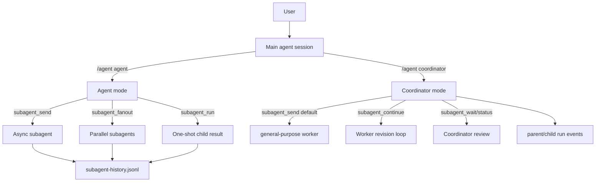
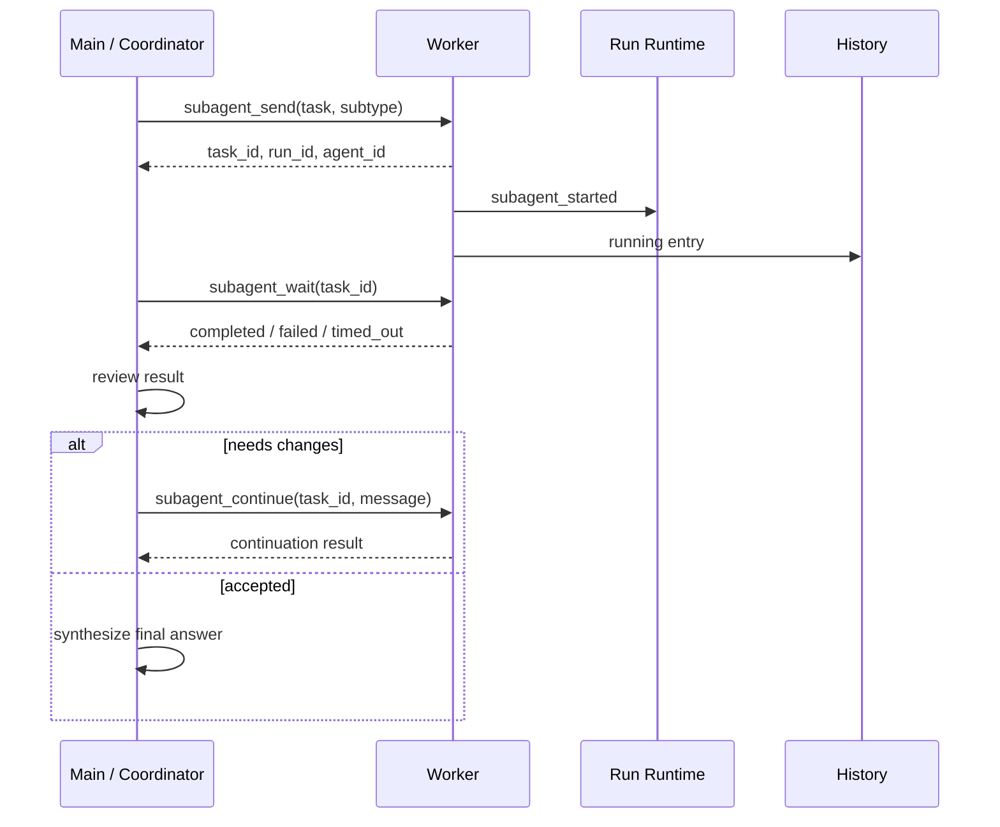

# Agent Collaboration Modes

This guide summarizes the agent collaboration modes that Tulkun supports
natively today.

In this document, "collaboration mode" means more than the user-visible
`/agent` selector. It also includes the subagent tools, async subagent lifecycle
tools, persistent batch work items, workboards, and cron-driven coordinator
workflows that are implemented inside Tulkun's own runtime.

These capabilities share the same session, run, tool, hook, permission, history,
and gateway infrastructure. They are not external scripts layered on top of the
product.

## Overview

Tulkun's collaboration model has three practical layers.

| Layer | Mode | Main entry point | Best for |
| --- | --- | --- | --- |
| Main-thread mode | `agent` | `/agent agent` | One main agent handles the task directly |
| Main-thread mode | `coordinator` | `/agent coordinator` or `enter_coordinator_mode` | The main agent plans, delegates, reviews, and synthesizes |
| Child execution | forked subagent | `subagent_run` / `subagent_send` without `subagent_type` | A child branch that needs parent-context continuity |
| Child execution | typed subagent | `subagent_type` set to a built-in type | Role-specific work with prompt and tool boundaries |
| Derived mode | fanout | `subagent_fanout` | Independent tasks that can run in parallel |
| Derived mode | async lifecycle | `subagent_send` / `wait` / `continue` / `close` | Long-running workers, review loops, and revisions |
| Persistent execution | batch work items | `batch_job_create` / `batch_work_items_append` | Durable background work queues and progress callbacks |
| Structured coordination | workboards | `workboard_*` tools | Task graphs, attempts, artifacts, and review state |
| Automation scenario | cron coordinator skill | skill calls `enter_coordinator_mode` / `exit_coordinator_mode` | Scheduled coordinator workflows such as GitHub issue autofix |

The core agent collaboration modes are:

1. Main-thread `agent` mode.
2. Main-thread `coordinator` mode.
3. Forked subagents.
4. Typed subagents.
5. Parallel fanout subagents.
6. Async subagent lifecycle.

Batch work items, workboards, and cron coordinator skills are native orchestration
capabilities built on top of the same runtime.

## Runtime Shape

Tulkun does not model collaboration as several unrelated chat windows. Child
work is linked to the same runtime graph as the parent run.



Key runtime facts:

- Each subagent has an `agent_id`, `task_id`, optional `run_id`, and parent
  `parent_run_id`.
- Child runs record `agent_kind`, `agent_type`, `runtime_kind`, and
  `query_source`.
- Durable subagent history is stored under Tulkun home at
  `state/subagent-history.jsonl`.
- Running async subagents also have an in-process registry handle for status,
  wait, and cancellation.
- When a parent run exists, child work is linked through the run runtime and
  emits lifecycle steps.

## 1. Agent Mode

`agent` is the default main-thread mode.

In this mode, the main agent understands the user request, calls tools, edits
files, runs verification, and reports back to the user directly.

Use:

```text
/agent agent
```

Use this mode when:

- The task is simple or moderately scoped.
- The user expects the main agent to complete the work directly.
- There is little value in parallelism.
- The task depends heavily on immediate conversation context.

The main agent can still call subagent tools in `agent` mode. In this mode,
calling `subagent_run` or `subagent_send` without `subagent_type` creates a
forked subagent.

## 2. Coordinator Mode

`coordinator` is Tulkun's main-thread coordination mode.

Use:

```text
/agent coordinator
```

Return to default mode with:

```text
/agent agent
```

Coordinator mode replaces the main-thread system prompt. The main agent becomes
responsible for:

- Understanding the user's goal and keeping the overall plan coherent.
- Deciding which work to handle directly and which work to delegate.
- Writing self-contained prompts for workers.
- Waiting for, reviewing, and synthesizing worker results.
- Sending concrete follow-up instructions to the same worker with
  `subagent_continue` when revision is useful.
- Reporting facts, verification evidence, and remaining risk to the user.

Important boundaries:

- Coordinator mode does not hide normal tools at the runtime layer.
- The rule that the coordinator should not directly implement repository source
  changes is a prompt and workflow contract, not a hard permission boundary.
- The coordinator may plan, dispatch, review, verify, inspect git state, operate
  GitHub, update tracking state, and produce the final user-facing report.
- Workers do not automatically receive the full main conversation, so worker
  prompts must be self-contained.

In coordinator mode, a subagent call without an explicit `subagent_type` is
converted to the built-in typed subagent `general-purpose`. This differs from
normal `agent` mode, where omitting `subagent_type` means a forked subagent.

## 3. Forked Subagents

A forked subagent is a child execution branch that starts from cache-safe parent
context.

Example input:

```json
{
  "task": "Investigate why package X fails and report the root cause."
}
```

This means: call `subagent_run`, `subagent_send`, or one item in
`subagent_fanout` without `subagent_type`, while not in coordinator mode.

Runtime markers:

| Field | Value |
| --- | --- |
| `agent_kind` | `fork` |
| `agent_type` | `fork` |
| `runtime_kind` | `fork_subagent` |
| `definition_source` | `parent` |
| `query_source` | `agent:builtin:fork` |
| `one_shot` | `false` |
| `continuable` | `true` |

Properties:

- The child tries to use cache-safe parameters and a parent-message snapshot.
- It is useful when the worker needs stronger continuity with the parent run.
- It is continuable by default, so an async forked subagent can receive
  `subagent_continue`.
- The worker channel is marked as `subagent_fork`.

Limits:

- A forked worker cannot call subagent tools.
- A forked worker cannot implicitly create another forked worker.
- If nested delegation is needed, the main agent or coordinator should dispatch
  the next worker.

## 4. Typed Subagents

A typed subagent is a fresh worker with a built-in role definition.

Example input:

```json
{
  "task": "Review the diff and report only correctness risks.",
  "subagent_type": "verification"
}
```

Runtime markers:

| Field | Value |
| --- | --- |
| `agent_kind` | `typed` |
| `runtime_kind` | `typed_subagent` |
| `definition_source` | `built-in` |
| `worker_session_id` | `agent:<parent-session>:subagent:<agent-id>` |
| `query_source` | `agent:builtin:<subagent_type>` |

Typed subagents use the system prompt for their subtype. They also use shared
tool-policy logic that filters both model-visible tools and the effective tool
pool used at execution time.

### Built-In Types

| `subagent_type` | Purpose | `one_shot` | `continuable` | Key tool boundary |
| --- | --- | --- | --- | --- |
| `general-purpose` | General implementation worker | `false` | `true` | Keeps normal worker capability; coordinator default |
| `explore` | Read-only investigation | `true` | `false` | No file edits, no git mutation, no shell, no subagents |
| `plan` | Read-only planning | `true` | `false` | No file edits, no shell, no subagents |
| `verification` | Verification and falsification | `false` | `true` | No project file or git mutation; can run checks |
| `cavecrew-investigator` | Compact read-only code locator | `true` | `false` | No writes, no shell, no subagents |
| `cavecrew-builder` | Compact tiny-scope editor | `false` | `true` | May edit in very small scope; no subagents |
| `cavecrew-reviewer` | Compact reviewer | `true` | `false` | No writes, no shell, no subagents |

Selection guide:

- Use `explore` for code location and fact gathering.
- Use `plan` for implementation design without code changes.
- Use `general-purpose` for small to medium implementation work.
- Use `verification` to test or falsify a recent change.
- Use `cavecrew-*` types when compact output and low token usage matter.

Limits:

- Current active subtype resolution exposes built-in definitions only.
- The code has a query-source branch for `agent:custom`, but that should not be
  treated as full support for arbitrary custom subagent types today.
- Built-in typed subagents cannot dispatch additional subagents.
- A subtype with `one_shot=true` and `continuable=false` cannot be continued
  with `subagent_continue`.

## 5. `subagent_run`: Synchronous Delegation

`subagent_run` starts one bounded isolated agent and waits for the final text
output.

Example input:

```json
{
  "task": "Find the files responsible for session restore and summarize the control flow.",
  "subagent_type": "explore"
}
```

The returned JSON string includes:

- `agent_id`
- `task_id`
- `run_id`
- `parent_run_id`
- `session_id`
- `query_source`
- `status`
- `output`
- `agent_kind`
- `agent_type`
- `runtime_kind`
- `one_shot`
- `continuable`

Use it for:

- A focused investigation.
- A small independent implementation task.
- A synchronous verification task.

Avoid it for:

- Work that needs review and revision loops.
- Long-running work where the main agent should keep coordinating other tasks.
- Large sets of parallel tasks. Use `subagent_fanout` or async lifecycle
  instead.

## 6. `subagent_fanout`: Parallel Delegation

`subagent_fanout` starts multiple isolated agents concurrently and aggregates
their results.

Example input:

```json
{
  "tasks": [
    {
      "prompt": "Inspect API route wiring and report files.",
      "subagent_type": "explore"
    },
    {
      "prompt": "Inspect persistence layer and report risks.",
      "subagent_type": "explore"
    }
  ],
  "max_parallel": 4,
  "fail_fast": false
}
```

Current behavior:

- `max_parallel` defaults to `4`.
- `max_parallel` is capped at `16`.
- A global subagent flight limit provides additional concurrency protection.
- Each task can specify its own `subagent_type`.
- The result is JSON with total, success count, failure count, and per-task
  outputs.
- With `fail_fast=true`, later tasks are skipped after the first error, and the
  tool returns the aggregate result with the error.

Use it for:

- Parallel code reading.
- Comparing several approaches.
- Independent module verification.
- Multi-repository or multi-directory fact gathering.

Avoid it for:

- Workers that write overlapping files.
- Tasks with strict ordering dependencies.
- Workers that need review and revision. Use async lifecycle instead.

## 7. Async Subagent Lifecycle

Async lifecycle is Tulkun's strongest native pattern for long-running
main-agent-to-worker collaboration.

Tool set:

| Tool | Purpose |
| --- | --- |
| `subagent_send` | Start an async subagent and immediately return identifiers |
| `subagent_list` | List recent subagents scoped to the current session or parent run |
| `subagent_status` | Read the latest status for one subagent |
| `subagent_wait` | Wait for a subagent, optionally with a timeout |
| `subagent_continue` | Send self-contained follow-up instructions to an existing subagent |
| `subagent_close` | Cancel a running async subagent |

Typical flow:



`subagent_continue` builds a new worker prompt from the original task, the
previous output, and the new follow-up instructions. The follow-up message must
be self-contained. Tulkun rejects continuation for one-shot non-continuable
subagents.

Use it for:

- Long-running tasks.
- Coordinator workflows that launch several workers and then synthesize results.
- Review loops where the same worker should fix its own previous work.
- Background workers that need status checks, waiting, or cancellation.

## 8. Batch Work Items

Batch work items are Tulkun's persistent background work queue.

They are not a `subagent_*` runtime kind, but they do execute prompts through
Tulkun's agent runtime and record durable state, logs, and output files.

Core tools:

| Tool | Purpose |
| --- | --- |
| `batch_job_create` | Create a parent job and start an in-process worker |
| `batch_work_items_append` | Append one or more work items to a parent job |
| `batch_work_items_list` | List work items with pagination |
| `batch_work_item_output_read` | Read a work item output file |
| `batch_job_cancel` | Cancel a parent job and queued or claimed work items |

Work item states are managed by `taskrt`:

- `queued`
- `claimed`
- `running`
- `done`
- `failed`
- `cancelled`

Use it when:

- The user does not need interactive worker-by-worker collaboration.
- Work should survive as a durable queue with status and output files.
- Gateway workflows need progress callbacks.

Difference from subagents:

- A subagent is best understood as delegated worker collaboration.
- A batch work item is best understood as durable background queue execution.
- Batch work items do not use `subagent-history.jsonl` as their primary state
  source.

## 9. Workboards

Workboards are structured task graphs. They are not workers by themselves.

They model:

- boards
- nodes
- edges
- attempts
- comments
- artifacts
- reviews
- tree, kanban, and list views

Available tools include:

- `workboard_list`
- `workboard_tree`
- `workboard_node_detail`
- `workboard_node_create`
- `workboard_node_update`
- `workboard_edge_create`
- `workboard_attempt_create`
- `workboard_attempt_complete`
- `workboard_comment_add`
- `workboard_artifact_add`
- `workboard_review_add`

Use them to:

- Represent multi-agent work as a trackable graph.
- Record attempts and review gates.
- Attach subagent or batch worker results as artifacts.

Relationship to subagents:

- A workboard represents task structure and review state.
- A subagent or batch worker performs execution.
- A coordinator can use both: create or update the task graph, then dispatch
  workers to execute nodes.

## 10. Cron Coordinator Skills

Tulkun's cron scheduler can run skills. A cron coordinator skill enters
coordinator mode agentically by calling `enter_coordinator_mode`, completes its
delegation and review workflow, then calls `exit_coordinator_mode`. The
scheduler does not infer coordinator mode from cron job arguments.

The main built-in example is `github-issue-autofix`.

In that workflow:

- A cron job triggers on schedule.
- The main coordinator reads GitHub issues, pull requests, comments, reviews,
  and tracking state.
- One repository-scoped subagent owns implementation work for one repository.
- Multiple repository subagents can run in parallel.
- The coordinator reviews diffs and verification evidence.
- If review fails, the coordinator uses `subagent_continue` to send concrete
  fixes to the same subagent.
- After acceptance, the coordinator commits, pushes, opens or updates pull
  requests, and creates or replies to GitHub comments.

This is not a new runtime kind. It is a productized combination of coordinator
mode, async subagents, cron, and skills.

## Choosing A Mode

| Need | Recommended mode |
| --- | --- |
| Answer a direct user question | Main-thread `agent` |
| Make a small code change | Main-thread `agent` or `general-purpose` typed subagent |
| Read several modules in parallel | `subagent_fanout` with `explore` |
| Preserve parent-context continuity | Forked subagent |
| Enforce role-specific behavior | Typed subagent |
| Run several workers concurrently | `subagent_fanout` or multiple `subagent_send` calls |
| Review and request revision | Async lifecycle with `subagent_continue` |
| Keep the main agent focused on coordination | `coordinator` |
| Run durable background queues | Batch work items |
| Track task graphs and review gates | Workboards |
| Process external events on a schedule | Cron coordinator skill |

## Safety And Permission Boundaries

Important current boundaries:

- Plan mode blocks `subagent_run`, `subagent_fanout`, file writes, shell, batch
  mutations, and other mutating tools.
- Coordinator mode does not hide normal tools automatically. Its role boundary
  is enforced by the coordinator system prompt and workflow.
- Typed subagent tool policy is shared in `codetools`; it affects both
  model-visible tools and the effective execution tool pool.
- Forked workers cannot call subagent tools.
- Built-in typed subagents cannot call subagent tools.
- `explore`, `plan`, `cavecrew-investigator`, and `cavecrew-reviewer` are
  read-only types.
- `verification` cannot modify project files or git state, but it can run
  verification commands.
- `cavecrew-builder` is intended only for very small edit scopes.

## Observability

Subagent lifecycle has two observable surfaces.

First, subagent history states:

- `running`
- `ok`
- `failed`
- `cancelled`

Second, run step events:

- `subagent_started`
- `subagent_dispatched`
- `subagent_wait_requested`
- `subagent_continue_requested`
- `subagent_cancel_requested`
- `subagent_completed`
- `subagent_failed`
- `subagent_cancelled`

These events let the TUI, gateway, channel paths, and review logic observe
worker lifecycle instead of seeing only final text output.

## Implementation Map

The current implementation is centered around these paths.

| Path | Responsibility |
| --- | --- |
| `internal/agentrun/subagent_tool.go` | `subagent_*` tools, fork/typed preparation, history, lifecycle |
| `internal/agentdefs/defs.go` | Built-in typed subagent definitions |
| `internal/codetools/subagent_tools.go` | Typed subagent visible-tool policy |
| `internal/codetools/modepolicy.go` | Plan, coordinator, and subagent tool guards |
| `internal/agentrun/coordinator_mode.go` | Coordinator main-thread prompt injection |
| `internal/coordmode/mode.go` | Coordinator system prompt and worker instruction contract |
| `internal/subagents/history.go` | Durable subagent history JSONL |
| `internal/subagents/registry.go` | In-process running subagent registry |
| `internal/taskrt/service.go` | Batch work item runtime |
| `internal/codetools/batch_workflow_tools.go` | Batch workflow tools |
| `internal/codetools/workboard_tools.go` | Workboard tools |
| `cmd/tulkun/cron_cmd.go` | Cron job creation and skill args |
| `tulkun-lab.github.io/docs/guide/github-issue-autofix.md` | Cron coordinator scenario documentation |

## What Is Not Supported Yet

Do not infer these capabilities from the current implementation:

- Workers dispatching more workers. Subagent tools are blocked inside forked
  workers and built-in typed workers.
- Arbitrary custom `subagent_type` values. Active definitions currently resolve
  built-in types only.
- Hard runtime permission isolation for coordinator mode. The coordinator
  boundary is a prompt and workflow boundary.
- Automatic execution of workboard nodes. Workboards model structure; execution
  still needs a subagent, batch work item, or main agent action.
