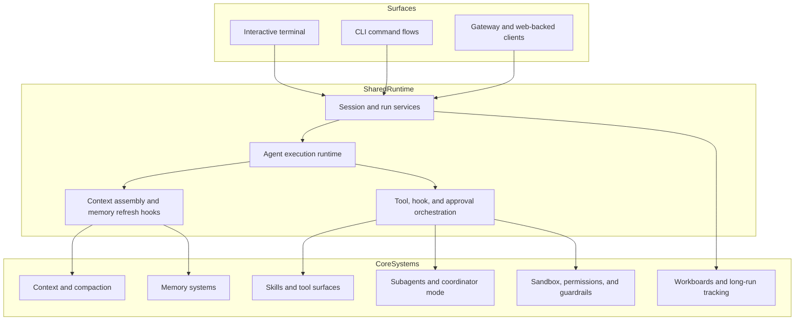
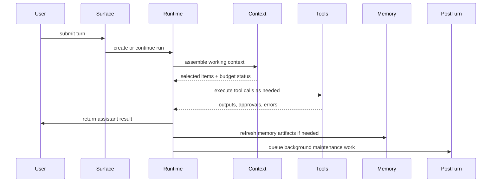

# Architecture

Tulkun is not one interface wrapped around one model call. It is a multi-surface
agent runtime built to support sustained technical work.

This page explains the system architecture at the product level:

- which surfaces Tulkun exposes
- which shared runtime layers those surfaces depend on
- how core systems such as memory, tools, subagents, workboards, and safety fit together

## Architectural Goal

Tulkun is designed for workflows that are longer, more stateful, and more
operationally sensitive than ordinary chat.

That creates a different architectural requirement from a normal assistant:

- the system must preserve session continuity
- it must execute tools safely
- it must coordinate long-running work
- it must support both interactive and service-backed surfaces
- it must keep memory, context, and approval systems consistent across those surfaces

## The Three Main Layers

At the highest level, Tulkun can be understood as three cooperating layers.

## Surface Layer

Tulkun exposes multiple user-facing surfaces because different operational
contexts need different interaction styles.

### Interactive Terminal

The terminal surface is optimized for day-to-day local work.

This is where users most directly experience:

- live turns
- slash commands
- approvals
- tool output
- session resume behavior
- local shell and workspace interactions

The terminal surface is intentionally close to the work. It is the most direct
way to use Tulkun as a coding agent rather than as a remote service.

### CLI Command Flows

Tulkun also exposes command-oriented flows that are not structured as an open
interactive session.

This matters for:

- inspection
- diagnostics
- operational control
- setup and validation workflows

### Gateway And Web-Backed Clients

The gateway surface turns Tulkun into a service runtime.

This matters when:

- a browser or web client needs to talk to Tulkun
- remote or shared usage matters
- integrations arrive through HTTP callbacks or service endpoints
- session state must be projected beyond one local terminal instance

## Shared Runtime Layer

The shared runtime is what keeps Tulkun from becoming several separate products.

No matter which surface you use, Tulkun still needs common answers to the same
questions:

- what session is this?
- what run is currently active?
- which agent is responsible?
- what context should be injected?
- which tools are available?
- which approvals are required?
- what memory artifacts should be refreshed after the turn?

### Session And Run Services

Tulkun represents work as sessions and runs, not as isolated prompt/response
pairs.

That distinction matters because:

- a session carries continuity
- a run carries execution state for one turn or delegated unit of work
- tool calls, approvals, subagents, and post-turn tasks can all be attached to a run

This is the backbone that lets Tulkun show:

- active work
- interrupted work
- child work
- audit trails
- resumable state

### Agent Execution Runtime

The execution runtime is the layer that turns a configured agent into a live
working process.

Its responsibilities include:

- selecting the active agent definition
- resolving model-provider chains
- building prompts
- registering tools
- running hooks
- applying approvals and policy
- handling delegated work

This is where Tulkun stops being “just configuration” and starts behaving like
an operational system.

### Context Assembly And Post-Turn Work

Tulkun does not simply feed “recent messages” to a model.

Before a turn, the runtime assembles a working context from multiple sources.
After a turn, it may trigger maintenance work such as:

- session memory refresh
- MagicDocs updates
- prompt suggestion generation
- tool-use summarization

This is a major architectural difference from stateless chat systems.

## Core Systems Layer

The core systems layer contains the mechanisms that make Tulkun usable for
serious multi-step work.

### Context And Compaction

Tulkun tracks context as a managed budget. It does not treat context overflow as
an accidental failure state.

That means the runtime can:

- score and select context items
- warn when the working set is getting too large
- recommend compaction
- compact a session into a continuity boundary instead of silently degrading

### Memory Systems

Tulkun's memory layer is deliberately split instead of collapsed into one vague
feature.

It includes:

- retrieval-oriented search memory
- Active Memory recall
- session memory distillation
- governance and consolidation paths
- documented dreaming state

Each part exists because “memory” in agent systems actually means several
different problems.

### Skills And Tool Surfaces

Tulkun separates:

- tools, which execute actions
- skills, which package reusable operating knowledge

This lets the runtime remain action-capable without reducing everything to a
flat command list.

### Subagents And Coordinator Mode

Tulkun supports multiple forms of delegated work.

At a high level:

- the main agent can stay in the primary thread
- coordinator mode can break work into steps
- subagents can perform bounded child work
- child runs can be tracked and resumed independently

This lets Tulkun scale from one-turn tasks to structured multi-step execution.

### Workboards And Long-Run Tracking

Tulkun includes a structured work representation for tasks that need more than a
transcript.

Workboards matter when work needs:

- nodes and dependencies
- attempts and retries
- artifacts and evidence
- review states
- progress summaries

This gives Tulkun a planning and execution memory that is stronger than chat
history alone.

### Sandbox, Permissions, And Guardrails

Safety in Tulkun is layered rather than monolithic.

The architecture keeps these concerns distinct:

- permission policy
- approval memory
- sandbox execution
- filesystem and network restriction
- guardrail-style input and output controls

That separation is what lets Tulkun stay useful without flattening every action
into a crude allow-or-block decision.

## Control Flow Through The System

A typical turn looks like this:

## Why This Architecture Matters

The architectural value is not abstraction for its own sake. It is practical.

It gives Tulkun the ability to:

- continue long sessions without collapsing into transcript sprawl
- expose the same core behavior across terminal and gateway surfaces
- coordinate delegated work without losing traceability
- attach safety decisions to real execution flows
- preserve operational state beyond one conversation window

## Practical Reading Guidance

If you are trying to understand one specific part of Tulkun, continue with:

- [Context and Compaction](/guide/context-and-compaction) for prompt-budget management
- [Memory Systems](/guide/memory-systems) for recall, session memory, and consolidation
- [Skills and Tools](/guide/skills-and-tools) for capability surfaces
- [Subagents and Workboards](/guide/subagents-and-workboards) for delegation and task structure
- [Safety Model](/guide/safety-model) for approvals, sandboxing, and guardrails
