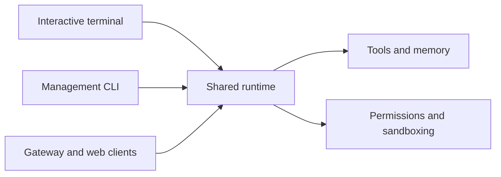

# CLI and Surfaces

Tulkun is not a single interface. It exposes multiple product surfaces that
share core runtime behavior but serve different user needs.

Understanding this is one of the fastest ways to avoid confusion.

## The Main Surfaces

### Interactive Terminal

The interactive terminal is the primary local workflow for:

- session-based coding work
- slash commands
- approvals
- visible run progress
- session continuity and resumption

This is the surface most users think of first when they hear "Tulkun".

### Gateway Service

The gateway surface is designed for service-backed operation.

Use it when you need:

- a runtime service instead of a local-only shell
- shared access patterns
- web-backed or gateway-driven usage
- API-oriented orchestration

### Management CLI

Tulkun also provides command-oriented operational surfaces for:

- configuration
- models
- memory
- skills
- supervision
- diagnostics
- scheduling and advanced workflows

These are not secondary conveniences. They are part of how Tulkun is operated.

## Why Multiple Surfaces Exist

The surfaces solve different problems.

| Surface | Best for |
| --- | --- |
| Interactive terminal | fast local iteration and live coding workflows |
| Gateway service | service-mode usage, shared clients, and integrations |
| Management CLI | inspection, operations, configuration, and maintenance |

Trying to treat them as one flattened UI leads to misunderstanding.

## Shared Runtime, Different Experiences

Although the surfaces differ, they are not unrelated products. They share core
runtime concepts such as:

- sessions
- runs
- tools
- permissions
- memory
- slash-style interaction models

What changes is how those capabilities are presented, controlled, and observed.

## Slash Commands

Tulkun includes a shared slash-command model across its interactive surfaces.

Representative commands include:

- `/model`
- `/permissions`
- `/memories`
- `/skills`
- `/compact`
- `/tasks`
- `/board`
- `/plan`
- `/agent`
- `/sandbox`
- `/ps`
- `/stop`

The important point is not the exact list. The important point is that slash
commands are part of Tulkun's product language across surfaces, not a terminal
hack layered on top.

## Surface Relationship

## What This Means In Practice

When you investigate Tulkun behavior, always ask:

- which surface am I using?
- is this feature interactive, service-backed, or command-oriented?
- does the behavior belong to the shared runtime or to the surface layer?

That framing avoids a large class of false assumptions.

## A Good Default Mental Model

Use this split:

- interactive terminal for live work
- gateway for service-backed usage
- management CLI for operating the system

That is a much better mental model than "Tulkun is a chatbot with some commands".

## Related

- [Getting Started](/guide/getting-started)
- [CLI Command Reference](/guide/cli-command-reference)
- [Architecture](/guide/architecture)
