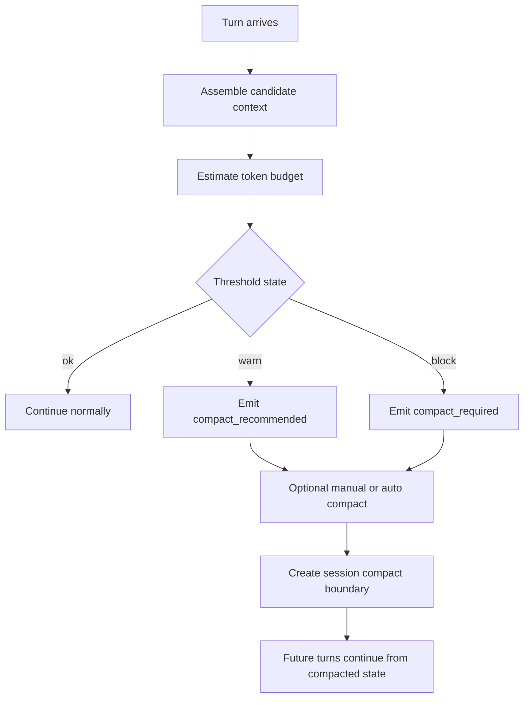

# Context and Compaction

Tulkun treats context as an explicit working-set problem.

That is a foundational product decision. Without it, long sessions eventually
become less accurate, less efficient, and harder to resume safely.

This page explains:

- how Tulkun assembles context
- how it decides what to keep and what to evict
- how it signals context pressure
- how session compaction works when pressure gets too high

## Why Context Needs Management

Agent systems accumulate state from many places, not only from the transcript.

In Tulkun, a single turn can potentially involve:

- recent conversation history
- transcript continuity
- Active Memory summaries
- workspace bootstrap documents
- workspace rules
- skill context
- pinned items
- recent run metadata
- tool evidence

If all of that is injected without budgeting, quality eventually degrades.

## Context Assembly Model

Tulkun assembles context from multiple sources into a candidate set of context
items.

Each item carries attributes such as:

- source identity
- layer
- priority
- estimated token cost
- pinned status

The runtime then selects the working set under a token budget rather than
blindly appending sources in one fixed order.

## Context Layers

Tulkun models context items in layers.

The main layers are:

- system
- workspace
- session
- working set
- evidence

This layering matters because not all context is equally durable or equally
important.

## The Selection Process

Tulkun's context engine roughly follows this flow:

1. collect candidate items from registered sources
2. estimate token cost for each item
3. boost or reduce effective priority based on source and intent
4. compact oversized item previews
5. sort by:
   pinned first, then priority, then token efficiency
6. select items until item-count and token limits are reached
7. record which items were selected and which were evicted

This produces both a working set and a provenance trail.

## Threshold States

Tulkun distinguishes between normal operation and context pressure.

The context engine tracks:

- total selected tokens
- estimated full input size for the turn
- warning threshold
- blocking threshold

This yields three practical states:

- `ok`
- `warn`
- `block`

Those states are not decorative. They drive compaction recommendations.

## Compaction Recommendations

When Tulkun detects growing pressure, it emits a compaction signal.

The two main recommendations are:

- `compact_recommended`
- `compact_required`

`compact_recommended` means the session is still usable but is drifting toward
context inefficiency.

`compact_required` means continuing without a boundary summary is likely to
damage continuity or overload the working set.

## Why Item Compaction Exists Before Session Compaction

Tulkun performs two different kinds of reduction:

### Item-Level Compaction

Before assembling the final working set, Tulkun trims context-item previews.

This is a lightweight measure used to:

- reduce oversized excerpts
- preserve source coverage while shrinking payload size
- avoid wasting budget on long raw blobs

### Session-Level Compaction

When the session itself becomes too large, Tulkun creates a session boundary
summary.

This is a stronger operation. It does not just shorten an item. It rewrites the
session history into a continuity artifact.

## Session Compaction Flow

## How Manual Compaction Works

Manual compaction creates a boundary message labeled as a session compact event.

Tulkun then:

1. gathers recent turns from the session
2. prefers an existing transcript-continuity note if one is available and non-template
3. otherwise produces a compact summary
4. writes a boundary message beginning with `Session compacted`
5. marks that boundary as the new session summary point

This matters because manual compaction is continuity-oriented, not just
shortening-oriented.

## How Auto Compaction Works

Auto compaction is driven by context pressure signals rather than by arbitrary
turn count alone.

If the context snapshot indicates blocking pressure or an explicit compact
requirement, Tulkun can compact automatically.

The trigger is therefore tied to:

- current budget state
- compaction recommendation
- actual session activity

## Why Transcript Continuity Matters To Compaction

Tulkun prefers transcript continuity as the seed for compaction when it is available.

That is an important design choice because transcript continuity is already a distilled
artifact. It is usually a better continuity anchor than a raw heuristic summary
of the whole transcript.

So in practice:

- transcript continuity helps compaction quality
- compaction helps preserve continuity
- the two systems reinforce each other

## Context Provenance And Eviction

Tulkun keeps track of which context items were:

- selected
- excluded because of token budget
- excluded because of item-count limits
- empty or unavailable

This is operationally useful because it makes context failures explainable.

Instead of “the model forgot,” Tulkun can reason about:

- what was present
- what was dropped
- why pressure increased

## Practical Interpretation

From a user perspective, context management answers four questions:

1. what did Tulkun decide to remember for this turn?
2. what did it leave out?
3. how close is the session to context overload?
4. when should the session be compacted?

That is the right mental model for using Tulkun effectively in long sessions.

## Related

- [Architecture](/guide/architecture)
- [Memory Systems](/guide/memory-systems)
- [Safety Model](/guide/safety-model)
