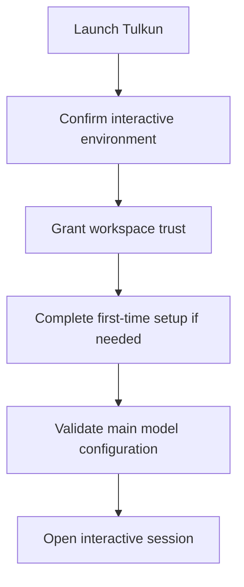

# First Session Tutorial

This tutorial walks a new user through the shape of a successful first Tulkun
session.

By the end, you should understand:

- what Tulkun asks for on first run
- how to reach a working interactive session
- what the main startup gates are
- what to check if the session does not open cleanly

## What You Need

- a local terminal session
- a Tulkun installation
- valid model-provider credentials for the main agent

## Step 1: Launch Tulkun Interactively

Start Tulkun through its interactive entry path.

If Tulkun does not detect a real terminal, it will not continue into the main
interactive experience. That is expected: the product distinguishes between
interactive and non-interactive entry conditions.

## Step 2: Trust The Workspace

If this is your first time entering the current workspace, Tulkun asks whether
the workspace should be trusted.

This trust step matters because Tulkun is designed for file access, code
editing, tool execution, and other operations that should not silently begin in
an unknown directory context.

What to do:

1. review the workspace path shown by Tulkun
2. accept trust if this is the directory you intend to work in
3. decline if you opened the wrong location

## Step 3: Complete Initial Setup

On a fresh installation, Tulkun may enter a first-time setup flow before opening
the main session.

The purpose of this setup stage is to ensure the interactive runtime does not
start in a half-configured state.

Typical outcomes of this step:

- Tulkun proceeds directly if setup is already complete
- Tulkun guides you through onboarding if core requirements are missing

## Step 4: Confirm Main Model Readiness

Tulkun requires a working primary model configuration for the main agent before
the session starts.

If that configuration is incomplete, Tulkun stops and asks you to fix it rather
than entering a misleading partial session.

At this stage, a successful setup means:

- a provider is selected
- a model is selected
- required credentials and connection details are available

## Step 5: Let Tulkun Open The Session

Once the startup checks pass, Tulkun opens the session and launches the
interactive runtime.

From the user point of view, this is the moment when Tulkun becomes a live
working environment rather than a setup workflow.

Expected capabilities here include:

- entering prompts
- seeing session state
- using slash commands
- working through run results and approvals

## Startup Flow Summary

## Verification

You have completed this tutorial successfully if:

- Tulkun opens its interactive interface
- you can enter a prompt
- the session feels live rather than blocked in setup

## Troubleshooting

### The session never opens

The most common causes are:

- the launch environment is not interactive
- workspace trust was not granted
- setup is incomplete
- the main model configuration is missing or invalid

### Tulkun keeps redirecting into setup

That usually means the installation is present but not operationally ready yet.
Finish the required onboarding or model configuration instead of retrying the
same launch path unchanged.

### You expected a gateway or web experience, not a shell

In that case, start with the gateway workflow rather than the interactive shell
workflow.

## What You Built

You now understand the normal first-session path:

- establish trust
- satisfy setup requirements
- validate the main model
- enter the interactive runtime

Next:

- [CLI and Surfaces](/guide/cli-and-surfaces)
- [Configuration Overview](/config/overview)
- [Architecture](/mechanics/architecture)
