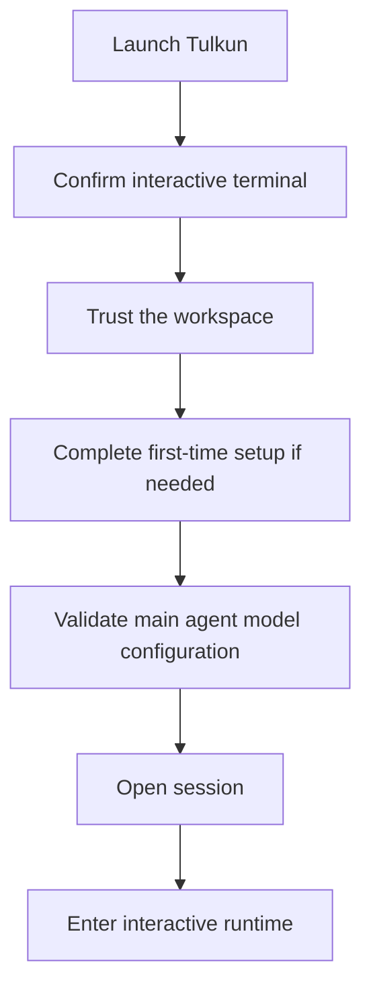

# Getting Started

This is the first guide page for Tulkun. It explains what Tulkun provides, what
to expect during the first run, and where to go next after the interactive
session opens.

## What Tulkun Provides

Tulkun combines several capabilities in one local runtime:

- an interactive terminal for direct coding work
- a gateway service for API-backed usage
- configurable agents and model providers
- memory features for retrieval, recall, and summarization
- reusable skills and callable tools
- subagents for structured execution
- permission and sandbox controls around tool execution

For a new user, the main goal is to reach a valid interactive session first.
After that, the rest of the guide explains the core runtime surfaces and
features.

## What You Need

Before starting Tulkun, make sure you have:

- a local terminal session
- a Tulkun installation
- valid model-provider credentials for the main agent
- a workspace you are willing to trust for file access and tool execution

## Start An Interactive Session

A clean first run is not just "open chat immediately". Tulkun performs a gated
startup flow so the interactive session begins in a valid state.

### Step 1: Launch Tulkun Interactively

Start Tulkun through its interactive entry path.

If Tulkun does not detect a real terminal, it will not continue into the main
interactive experience. That is expected: Tulkun distinguishes interactive and
non-interactive entry conditions.

### Step 2: Trust The Workspace

If this is your first time entering the current workspace, Tulkun asks whether
the workspace should be trusted.

This matters because Tulkun is designed for file access, code editing, tool
execution, and other operations that should not silently begin in an unknown
directory context.

When prompted:

1. review the workspace path
2. accept trust if this is the directory you intend to work in
3. decline if you opened the wrong location

### Step 3: Complete Initial Setup

On a fresh installation, Tulkun may enter a first-time setup flow before opening
the main session.

The purpose of this setup stage is to ensure the runtime does not start in a
half-configured state.

Typical outcomes:

- Tulkun proceeds directly if setup is already complete
- Tulkun guides you through onboarding if required configuration is missing

### Step 4: Confirm Main Model Readiness

Tulkun requires a working primary model configuration for the main agent before
the session starts.

At this stage, a working setup means:

- a provider is selected
- a model is selected
- required credentials and connection details are available

If that configuration is incomplete, Tulkun stops and asks you to fix it rather
than entering a misleading partial session.

### Step 5: Enter The Runtime

Once the startup checks pass, Tulkun opens the session and launches the
interactive runtime.

Expected capabilities include:

- entering prompts
- seeing session state
- using slash commands
- working through run results and approvals

## Choose The Right Surface

Tulkun exposes more than one product surface. Start with the interactive
terminal unless you specifically need service-backed usage.

### Interactive Terminal

Use this surface when you want:

- terminal-first coding work
- slash commands
- approvals in context
- visible session and run continuity

### Gateway Service

Use the gateway path when you want:

- API-backed usage
- shared access patterns
- web-oriented workflows
- runtime APIs and service health management

The gateway path still depends on valid setup and model configuration.

### Management CLI

Use command-oriented workflows when you need to inspect or operate Tulkun:

- runtime status
- model configuration
- memory state
- skills
- active or recent runs

## First Checks To Run

After Tulkun is installed, these are the most useful checks to perform early:

- inspect runtime status
- verify the configured model provider
- confirm configuration loading
- confirm memory status
- list installed skills

These checks tell you whether Tulkun is merely installed or actually ready for
useful work.

## Common Misunderstandings

### Tulkun Is Not Only A Chat Interface

Tulkun has multiple user surfaces and operational workflows. Some features are
best understood as runtime systems rather than UI buttons.

### Startup Validation Is Intentional

Tulkun validates trust, setup, and model readiness before starting the main
interactive experience. That is part of the product design.

### Not Every Feature Belongs To The Same Layer

Some concerns belong to the interactive experience, some belong to the gateway
service, and some are shared runtime systems used by both.

## Troubleshooting

### Tulkun Does Not Enter The Interactive Shell

Most often, one of these is true:

- the session is not running in an interactive terminal
- workspace trust has not been granted yet
- initial setup is incomplete
- the main agent model configuration is missing or invalid

### Tulkun Keeps Redirecting Into Setup

That usually means the installation is present but not operationally ready yet.
Finish the required onboarding or model configuration instead of retrying the
same launch path unchanged.

### You Expected A Gateway Or Web Experience

Start with the gateway workflow rather than the interactive shell workflow.

## Continue Reading

1. [CLI and Surfaces](/guide/cli-and-surfaces)
2. [Architecture](/guide/architecture)
3. [Context and Compaction](/guide/context-and-compaction)
4. [Memory Systems](/guide/memory-systems)
5. [Skills and Tools](/guide/skills-and-tools)
6. [Subagents](/guide/subagents)
7. [Safety Model](/guide/safety-model)
8. [CLI Command Reference](/guide/cli-command-reference)
9. [Telemetry](/guide/telemetry)
