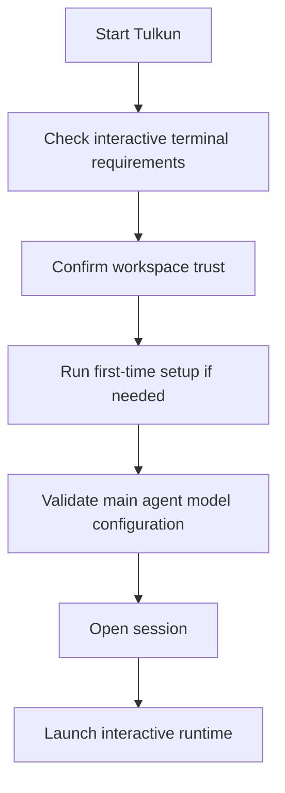

# Getting Started

This page gives a product-level introduction to starting Tulkun and choosing the
right runtime path.

## What Tulkun Provides

Tulkun combines several capabilities in one system:

- an interactive terminal for direct coding work
- a gateway runtime for service-backed usage
- configurable agents and model providers
- memory features for retrieval, recall, and summarization
- reusable skills and callable tools
- workboards and subagents for structured execution

For a new user, the most important entry points are:

- the interactive shell
- the gateway service

## Choose A Startup Path

Tulkun supports two practical ways to run locally.

### Direct Binary Path

This is the better choice when:

- you are developing Tulkun itself
- you want explicit control over local binaries and runtime setup
- you are debugging environment-sensitive behavior

### Packaged Launcher Path

This is the better choice when:

- you want a more turnkey local install experience
- you want Tulkun to resolve more runtime details for you
- you want a smoother path for packaged usage

In practice, the packaged launcher is designed to reduce setup friction around
runtime dependencies and skill discovery.

## First Run Expectations

A clean first run is not just "open chat immediately". Tulkun performs a gated
startup flow so that the interactive session begins in a valid state.

As a user, this means you should expect some combination of:

- workspace trust confirmation
- onboarding or setup guidance on the first run
- model or provider configuration requirements before the main shell opens

That is normal behavior.

## If You Want The Interactive Shell

Use the interactive entry path when you want:

- a terminal-first workflow
- slash commands
- approvals in context
- visible session and run continuity

If Tulkun cannot start a valid interactive session, it does not silently degrade
into an unclear state. It stops and tells you what is missing.

## If You Want The Gateway Service

Use the gateway path when you want:

- service-backed usage
- shared access patterns
- gateway and web-oriented workflows
- runtime APIs and service health management

The gateway path still depends on valid first-time setup and main model
configuration.

## First Checks To Run

Once Tulkun is installed, these are the most useful checks to perform early:

- inspect runtime status
- verify the configured model provider
- confirm configuration loading
- confirm memory status
- list installed skills

Those checks tell you whether Tulkun is merely installed or actually ready for
useful work.

## Common Misunderstandings

### Tulkun is not only a chat interface

It has multiple user surfaces and operational workflows. Some features are best
understood as runtime systems rather than UI buttons.

### Startup validation is intentional

Tulkun validates trust, setup, and core model readiness before starting the main
interactive experience. That is part of the product design, not an incidental
friction point.

### Not every feature belongs to the same layer

Some concerns belong to:

- the interactive experience
- the gateway/service layer
- core runtime systems shared by both

This is why the rest of the documentation is organized by surface and mechanism.

## Recommended Reading Order

1. [First Session Tutorial](/guide/first-session-tutorial)
2. [CLI and Surfaces](/guide/cli-and-surfaces)
3. [CLI Command Reference](/guide/cli-command-reference)
4. [Configuration Overview](/config/overview)
5. [Architecture](/mechanics/architecture)

## Troubleshooting

### Tulkun does not enter the interactive shell

Most often, one of these is true:

- the session is not running in an interactive terminal
- workspace trust has not been granted yet
- initial setup is incomplete
- the main agent model configuration is not ready

### Tulkun starts, but you are unsure which surface you are using

Read [CLI and Surfaces](/guide/cli-and-surfaces). Many practical questions become
clear once you distinguish the terminal workflow from the gateway workflow.
