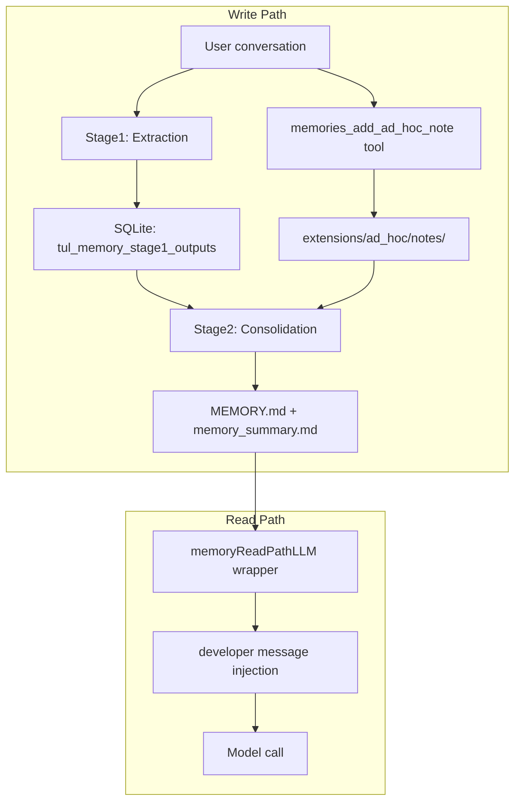

# Memory Internals

This document is based on tulkun source code analysis. It systematically covers the memory isolation model, write mechanisms, read/injection mechanisms, LLM provider compatibility, and a complete scenario walkthrough. It is intended for developers who need a deep understanding of memory internals.

For a product-level overview, read [Memory Systems](/guide/memory-systems) first.

::: tip Bilingual
[中文版本](/guide/memory-internals-zh)
:::

## Architecture Overview



tulkun memory consists of the following core components:

| Component | Package | Responsibility |
|-----------|---------|---------------|
| `Store` | `internal/memories` | Bound to a single primary agent; all reads/writes filtered by `agent_id` |
| `Pipeline` | `internal/memories` | Background async Stage1 extraction + Stage2 consolidation |
| `memoryReadPathLLM` | `internal/agentrun` | LLM wrapper that injects memory_summary on every model call |
| Dedicated memory tools | `internal/codetools` | `memories_list` / `memories_read` / `memories_search` / `memories_add_ad_hoc_note` |
| `localbackend.Backend` | `internal/memories/localbackend` | Filesystem read/write backend for memory artifacts |

## Isolation Dimension: Tenant, Not Project

### Core Conclusion

tulkun memory's sole isolation boundary is **Tenant (primary agent / agentID)**. **There is no project-dimension memory mechanism.**

### Evidence

`Store` is bound to a single `agentID`. All SQL queries filter by `agent_id=?`:

- **Extraction** — `ClaimStage1JobsForStartup` (`jobs.go:102`):
  ```sql
  WHERE agent_id=? AND memory_mode=? AND id<>? AND memory_source IN (?,?) AND updated_at>=? AND updated_at<=?
  ```
- **Consolidation selection** — `SelectStage1ForPhase2` (`store.go:235`):
  ```sql
  WHERE o.agent_id=? AND s.agent_id=? AND s.memory_mode=?
  ```
- **Write/delete/usage update** — `UpsertStage1Output`, `DeleteThreadMemory`, `UpdateUsage` all use `agent_id=?`

The consolidation job key is also the tenant itself: `consolidateJobKey(agentID) = agentID` (`jobs.go:43`).

### Memory File Root = Per-Tenant Workspace Root

```
ResolveRootForAgent(workspaceRoot) → <workspaceRoot>/memories/   (root.go:28)
```

- `workspaceRoot()` (`runner.go:1424`) = `r.WorkspaceRoot` or `~/.tulkun/workspace` — this is per-agent
- `MEMORY.md` / `memory_summary.md` live under the per-tenant directory — **no project key in the path**

### `memories/project.go` Functions Serve Other Subsystems

`project.go` defines `ProjectKey()` / `ProjectRoot()` / `GitBranch()`, but they are **not used for memory store isolation/filtering**:

| Function | Actual purpose | Callers |
|----------|---------------|---------|
| `ProjectKey()` | Plan file directory `planstore.PlanDirForProject`, subagent inheritance | `clifacade/chat_session.go`, `workerhost/open.go` |
| `ProjectRoot()` | File tool default path, permissions | `clifacade/chat_session.go` |
| `GitBranch()` | Written to `tul_sessions.git_branch` column (session metadata) | `clifacade`, `workerhost` |

`Store` never calls any of these functions internally.

### Cwd / GitBranch Are Descriptive Metadata Only

`Stage1Output` and `SessionCandidate` structs have `Cwd` and `GitBranch` fields, but they:

1. Are only SELECTed out as metadata
2. Written to rollout summary file headers (`storage.go:78-84`) and evidence JSONL (`evidence.go:30-34`)
3. **Never appear in any WHERE clause** — not used for extraction/consolidation/read filtering

### Isolation Test Verification

`tenant_isolation_test.go` explicitly verifies: two agents share the same SQLite DB, isolation is achieved entirely through `agent_id` filtering, project does not participate.

## Write Mechanism

Memory writes have two paths that converge into the same `MEMORY.md`.

### Path 1: Ad-hoc Note (Immediate Write)

When the user explicitly asks to "remember...", the agent calls the `memories_add_ad_hoc_note` tool:

```
memories_add_ad_hoc_note
  → backend.AddAdHocNote(filename, note)                    (memory_tools.go:61)
  → writes to <workspaceRoot>/memories/extensions/ad_hoc/notes/<timestamp>-<slug>.md
```

- Default `DedicatedTools=true` (`config.go:368`), tool is registered by default
- Tool description: "Create one append-only ad-hoc memory note after the user explicitly asks Tulkun to remember, forget, or update something."
- Write is **immediate**, but the note only lives in the extensions directory — **not in `MEMORY.md`**
- The `read_path.md` template's listed searchable files do not include `extensions/ad_hoc/notes/`, so ad-hoc notes **are not immediately visible to the main agent via the read path**

### Path 2: Automatic Extraction + Consolidation (Async Pipeline)

#### Trigger Timing

After each root interactive turn, `maybeLaunchMemoryStartup` (`supervisorrun/run.go:186`) fires `Pipeline.Run`:

```go
func maybeLaunchMemoryStartup(o Options, sessionID string) {
    if o.Runner == nil { return }
    if strings.TrimSpace(o.ParentRunID) != "" { return }   // subagents don't trigger
    if !isRootInteractiveSource(querySourceForRun(o)) { return }
    o.Runner.LaunchMemoryStartup(sessionID)
}
```

#### Stage1: Extraction

`ClaimStage1JobsForStartup` selects eligible sessions from `tul_sessions`:

- `agent_id=?` — current tenant
- `memory_mode=enabled` — session has memory enabled
- `memory_source IN ('streamterm','webchat')` — from interactive surfaces
- `updated_at >= now - MaxRolloutAgeDays` (default 10 days)
- `updated_at <= now - MinRolloutIdleHours` (default **6 hours** idle)

::: warning 6-Hour Idle Threshold
The current session won't be extracted until it has been idle for 6 hours. This means when a user says "remember...", that conversation is not immediately extracted as raw memory — it must wait 6 hours of idleness before entering Stage1.
:::

Stage1 uses the ExtractLLM to produce structured JSON (`raw_memory` / `rollout_summary` / `rollout_slug`) from the conversation transcript, redacts secrets, and writes to the `tul_memory_stage1_outputs` table.

#### Stage2: Consolidation

`runStage2` (`pipeline.go:292`) **runs regardless of whether Stage1 produced output**:

1. `TryClaimGlobalPhase2` acquires the consolidation lock (6-hour cooldown)
2. `SelectStage1ForPhase2` selects all stage1 outputs for the current tenant
3. `syncPhase2WorkspaceInputs` syncs outputs to the memories directory (`raw_memories.md` + `rollout_summaries/`)
4. `memoryWorkspaceDiff` computes the git diff of the memories directory
5. If `changed=true` → consolidation LLM runs, reads workspace diff + ad-hoc notes, merges into `MEMORY.md` + `memory_summary.md`
6. `validateConsolidationArtifacts` validates outputs (`MEMORY.md` exists, `memory_summary.md` first line is `v1`)

::: tip Ad-hoc Note Consolidation
Ad-hoc notes appear as new files in the git diff. The consolidation LLM follows `ad_hoc_instructions.md` instructions to merge note content into `MEMORY.md` and `memory_summary.md`. The instructions state: "Every note must be consolidated in the memory structure."
:::

## Read and Injection Mechanism

### Core Conclusion: MEMORY.md Is Never Directly Injected

What is automatically injected is `memory_summary.md` (a separate index/summary file), not `MEMORY.md`. `MEMORY.md` is only **mentioned** in the injected template text — the agent must actively retrieve it.

### Injection Chain

**Installation timing** — `loadLocked()` (`runner.go:729`) builds the LLM client chain:

```go
llmClient = wrapMemoryReadPathLLM(llmClient, r.workspaceRoot(), r.AppCfg)
```

Triggers: runner initialization, config hot-reload, `/model` switch.

**Execution timing** — every LLM `Execute` call (i.e., every model call in every turn):

```go
func (w *memoryReadPathLLM) Execute(ctx, messages, tools) {
    root, _ := memories.ResolveRootForAgent(w.workspaceRoot)
    instruction, _ := memories.RenderReadPathInstruction(root)  // real-time disk read
    if instruction != "" {
        messages = memories.InjectDeveloperInstruction(messages, instruction)
    }
    return w.inner.Execute(ctx, messages, tools)
}
```

**No caching** — `memory_summary.md` is re-read from disk every time. If the consolidation pipeline updates the file between turns, the next LLM call sees the new content immediately.

### Injection Content Generation

```
<workspaceRoot>/memories/memory_summary.md
  → os.ReadFile                                        (read_path.go:19)
  → TrimSpace, skip if empty                           (read_path.go:26-28)
  → truncateTextToTokenBudget(content, 2500)           (read_path.go:30)  ← truncate to 2500 tokens
  → renderTemplate(readPathInstruction, {              (read_path.go:31-34)
        base_path:      root.MemoryRoot,
        memory_summary: content,
    })
  → InjectDeveloperInstruction                         (read_path.go:37-49)
```

`renderTemplate` is a simple `strings.ReplaceAll`: it replaces `{{ base_path }}` and `{{ memory_summary }}` in the full `read_path.md` template text with actual values. **All other template text is preserved verbatim.**

Final injected message structure:

```
[System message]
[Developer message: full read_path.md template + truncated memory_summary.md content]   ← here
[User/Assistant messages...]
```

### read_path.md Template Content

The entire template is injected, including:

| Template section | Description |
|-----------------|-------------|
| Decision boundary | "Skip memory ONLY when..." — when to use memory |
| Memory layout | Lists memory_summary.md / MEMORY.md / skills/ / rollout_summaries/ structure |
| Quick memory pass | 5-step retrieval workflow guidance |
| Citation requirements | `<oai-mem-citation>` format specification |
| Updating memories | "only when explicitly asked..." write guidance |
| `{{ memory_summary }}` | Replaced with memory_summary.md content truncated to 2500 tokens |
| `{{ base_path }}` | Replaced with actual path, e.g. `~/.tulkun/workspace/memories` |

### Three Ways to Reach MEMORY.md

| Method | Mechanism | Automatic? |
|--------|-----------|------------|
| `memory_summary.md` injection | developer message, every LLM call | ✅ Automatic |
| read_path template guided search | Template text guides agent to "search MEMORY.md" | ❌ Depends on LLM initiative |
| Dedicated tools | `memories_search` / `memories_read` / `memories_list` | ❌ Depends on LLM calling tools |

### Injection Prerequisites

1. `ReadPathEnabled(cfg)` = true (checked at construction time)
   - i.e., `features.memories=true` **and** `memories.use_memories=true` (both default to true)
2. `memory_summary.md` file exists and is non-empty (checked at runtime)
3. Re-checked on every Execute call

## LLM Provider Compatibility

The injected developer message has role **`developer`** (`llm.RoleDeveloper = "developer"`, `llm.go:260`).

The source code comment specifies: providers that do not support the developer role must map it to their closest instruction role.

| Provider | Role sent to API | Source location |
|----------|-----------------|-----------------|
| OpenAI Responses API | `developer` (native support) | `openai_responses_llm.go:649-654` |
| OpenAI-compatible (DeepSeek, etc.) | **Downgraded to `system`** | `openai_compat_llm.go:1075-1081` |
| Anthropic | **Merged into system parts** | `anthropic_agent_llm.go:194` |

Providers that don't support the `developer` role all downgrade to `system` role — content is never lost.

## Scenario Example: "No Unit Tests" Memory for Project A

### Scenario

The user launches tulkun TUI from the root of a Java project (Project A) and asks the primary agent to remember: "Project A should not generate unit test code."

### Where Is It Stored?

Memory is stored at the **agent (tenant) level workspace directory**, not the project level:

```
<workspaceRoot>/memories/
```

Where `<workspaceRoot>` = `rt.StateRoot()` = the agent's workspace root (typically `~/.tulkun/workspace`), **unrelated to the Project A path where the user launched the TUI**.

### Write Timeline

```
1. User: "Remember that Project A should not generate unit tests"
   → agent calls memories_add_ad_hoc_note
   → note immediately written to <workspaceRoot>/memories/extensions/ad_hoc/notes/<timestamp>-<slug>.md
   (at this point the note is NOT in MEMORY.md; the main agent cannot see it via read path)

2. Current turn ends → maybeLaunchMemoryStartup → Pipeline.Run
   → Stage1: MinRolloutIdleHours=6, current session not idle enough, won't be extracted
   → Stage2: runStage2 runs (if 6h cooldown has passed)
     → memoryWorkspaceDiff detects ad-hoc note as a new file
     → consolidation LLM runs, merges note into MEMORY.md + memory_summary.md

3. Subsequent turns
   → memoryReadPathLLM.Execute reads memory_summary.md from disk
   → injects as developer message
   → agent sees the memory and follows it during development
```

### Does It Actually Take Effect?

**Yes, it takes effect** — but with delays and limitations:

| Limitation | Reason | Source |
|-----------|--------|--------|
| Ad-hoc note doesn't immediately appear in memory_summary.md | read_path.md template's searchable files don't include `extensions/ad_hoc/notes/`; must wait for consolidation into MEMORY.md | `read_path.md:19-33` |
| Consolidation has 6-hour cooldown | `phase2CooldownSeconds = 6*60*60` | `jobs.go:29` |
| Consolidation runs asynchronously in background | `LaunchAsync` starts a goroutine; may fail | `pipeline.go:39-52` |

### Can It Be Recalled When Developing Project A?

**After consolidation completes, yes**:

- `memory_summary.md` is automatically injected into the system prompt every turn (truncated to 2500 tokens)
- The read_path.md template guides the agent to search `MEMORY.md` for relevant keywords
- The agent can use `memories_search` / `memories_read` to actively retrieve

### Cross-Project Leakage

::: warning No Project-Dimension Isolation
Memory is stored at the agent (tenant) level under `<workspaceRoot>/memories/`. When the same agent develops Project B, it **will also see** the "Project A should not generate unit tests" memory. The system performs no project-level filtering — whether the constraint applies only to Project A depends entirely on the LLM inferring from the text "Project A" in the memory.
:::

## Configuration Parameters

All memory config options are enabled by default and adjustable via YAML:

```yaml
features:
  memories: true              # master memory switch

memories:
  use_memories: true          # read path switch
  generate_memories: true     # generation (extraction) switch
  dedicated_tools: true       # dedicated memory tools switch
  max_unused_days: 30         # max days stage1 output can go unused (pruned after)
  max_rollout_age_days: 10    # max session age for extraction (days)
  max_rollouts_per_startup: 2 # max sessions extracted per startup
  min_rollout_idle_hours: 6   # hours a session must be idle before extraction
  min_rate_limit_remaining_percent: 25  # minimum rate limit remaining percent
```

Source: `internal/config/config.go:331-374`

## Memory Artifact File Structure

```
<workspaceRoot>/memories/
├── memory_summary.md          # Auto-injected summary index, first line must be v1
├── MEMORY.md                  # Memory handbook, main file for active retrieval
├── raw_memories.md            # Merged Stage1 raw memories (temp file, Phase2 input)
├── rollout_summaries/         # Per-session summary recaps
│   └── <timestamp>-<hash>-<slug>.md
├── skills/                    # Reusable skills
│   └── <skill-name>/
│       └── SKILL.md
├── extensions/
│   └── ad_hoc/
│       ├── instructions.md    # Ad-hoc note consolidation guidance
│       └── notes/             # User-requested memories (pending consolidation)
│           └── <timestamp>-<slug>.md
└── phase2_workspace_diff.md   # Phase2 git diff (temp, not a persistent artifact)
```

## Limitations and Caveats

1. **No project-dimension isolation** — Memory is isolated by tenant. All project memories for the same agent are mixed in a single `MEMORY.md`. Cross-project constraints may interfere with each other.

2. **Consolidation delay** — Ad-hoc notes don't take effect immediately after writing. They must wait for the consolidation cycle. In the worst case, this requires waiting for the 6-hour cooldown to pass before consolidation can run.

3. **Depends on LLM judgment** — Memory extraction, consolidation, and retrieval all rely on LLM judgment. Lower-capability models may fail to extract high-signal memories or may miss relevant content during retrieval.

4. **memory_summary.md truncation** — Injection truncates to 2500 tokens. If the summary is too long, the middle portion is truncated (via `MiddleTokens` strategy), potentially losing critical content.

5. **MEMORY.md is not auto-injected** — Only `memory_summary.md` is automatically injected. `MEMORY.md` content requires the agent to actively read it via tools or file search.

## Related

- [Memory Systems](/guide/memory-systems) — Product-level memory overview
- [Context and Compaction](/guide/context-and-compaction) — Session continuity and compaction
- [Memory, Compaction, And Runtime Features](/config/memory-and-runtime-features) — Configuration reference
- [Architecture](/guide/architecture) — Overall architecture
- [中文版本](/guide/memory-internals-zh) — Chinese version of this page
