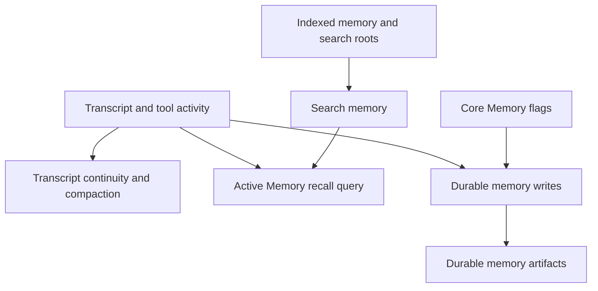

# Memory Systems

Tulkun uses multiple memory layers because a single generic “memory” feature is
not enough for serious agent work.

This page explains the roles, boundaries, and interactions of:

- retrieval-oriented search memory
- Active Memory
- transcript continuity
- durable memory
- Core Memory and dreaming flags

## Why Tulkun Splits Memory Into Multiple Systems

Different memory problems require different tools.

For example:

- finding a relevant old fact is not the same as summarizing the current session
- deciding what to inject into the next turn is not the same as long-term consolidation
- keeping context continuity is not the same as exporting a search index

Tulkun therefore separates memory by job, not by storage location alone.

## The Main Memory Roles

## Search Memory

Search memory is Tulkun's retrieval-oriented memory layer.

Its job is to make previously written or indexed information discoverable again.

This matters when:

- workspace or memory data should be searched rather than replayed from transcript
- embedding-backed retrieval is available
- fallback retrieval modes are needed when vector infrastructure is absent

Search memory is usually configured through `agents.defaults.memory_search`.

Operationally, it can include:

- provider and model selection
- remote embedding or search services
- extra search roots
- hybrid ranking
- vector-store configuration

Search memory does not decide by itself what enters the current turn. It makes
candidate information discoverable.

## Active Memory

Active Memory is a turn-time recall mechanism.

Its job is to decide whether useful prior knowledge should be summarized and
brought into the current turn before the main response continues.

That makes it fundamentally different from plain retrieval.

### What Active Memory Actually Does

At a high level, Active Memory:

1. decides whether the current agent and chat type are allowed to use it
2. builds a recall query from the current turn and recent session material
3. runs a dedicated recall flow
4. returns a short summary for context injection
5. caches results briefly to avoid redundant repeated work

### Why Active Memory Is Separate From Transcript Continuity

Transcript continuity is provided by the persisted transcript and replacement-history compact checkpoints.

Active Memory is a live recall step for the next turn.

That means:

- transcript continuity is continuity-oriented
- Active Memory is prompt-injection-oriented

### Active Memory Defaults That Matter Operationally

The runtime has effective defaults for:

- allowed agents: `main`
- allowed chat types: `direct`
- query mode: `recent`
- prompt style: `balanced`
- timeout: `15000 ms`
- summary size cap: `220 chars`
- short-term user and assistant windows
- cache TTL: `15000 ms`

These defaults make Active Memory conservative by default.

### Query Modes

Active Memory supports multiple query modes because “recent context” can mean
different things in practice.

- `recent`: short recent-window recall
- `message`: more message-specific shaping
- `full`: broader transcript-conditioned recall

If no valid mode is configured, Tulkun falls back to `recent`.

### Prompt Styles

Prompt style controls how the recall prompt is phrased rather than whether
recall happens at all.

Supported styles include:

- `balanced`
- `strict`
- `contextual`
- `recall-heavy`
- `precision-heavy`
- `preference-only`

If the configured style is invalid or omitted, Tulkun infers a style from the
query mode.

## Transcript Continuity

Transcript continuity is provided by the persisted transcript and replacement-history compact checkpoints.

It does not create a separate continuity artifact.

### Why Transcript Continuity Exists

Long sessions accumulate too much model-active history to be replayed verbatim forever.

Local summary compaction asks the current main model to preserve:

- the current state of the work
- unresolved problems
- key decisions
- corrections from the user
- the next useful continuation point

available in a compact form. OpenAI remote compaction instead stores the
provider's complete replacement history, including its opaque compaction item.

### What Triggers A Checkpoint

Automatic compaction runs at the model's token threshold before a turn and
between model samples. `/compact` triggers the identical checkpoint pipeline
manually. There is no background transcript-refresh job and no separate compact
agent.

### What Transcript Continuity Produces

The transcript continuity artifact is designed to preserve current continuity rather
than to become a permanent knowledge base entry.

It is especially important because:

- future turns resume from the latest complete replacement history
- resumed sessions can recover current state faster

## Durable Memory

Tulkun supports durable memory as explicit long-lived notes written into the
workspace memory surfaces.

These writes are validated, deduplicated, indexed, and can carry metadata such
as trust, review state, validity windows, and conflict-set membership.

This matters because not all memory transitions should happen inline during the
user-facing turn, but durable memory itself remains an explicit runtime surface
rather than a background promotion system.

## Core Memory And Dreaming

Tulkun exposes a `memory.core` block and a documented dreaming state.

The important product interpretation is:

- `memory.core` represents the documented Core Memory surface
- `dreaming` flags mirror consolidation-oriented state
- when dreaming frequency is unset, Tulkun reports it as `manual`

The dreaming flags are not a separate magical memory engine. They are part of
the documented memory-governance and consolidation story.

## How The Memory Layers Work Together

The layers are most useful when understood as a pipeline rather than as a list.

- search memory makes information discoverable
- Active Memory decides what is worth recalling into the current turn
- transcript continuity keeps current continuity compressed
- governance paths maintain longer-lived structure around those artifacts

That interaction is what lets Tulkun sustain longer sessions without depending
on raw transcript replay alone.

## Practical Reading Guidance

If you are configuring behavior:

- use `/config/agents-and-models` for search memory and governance settings
- use `/config/memory-and-runtime-features` for Active Memory and Core Memory flags

If you are reasoning about continuity:

- read [Context and Compaction](/guide/context-and-compaction) next

## Related

- [Context and Compaction](/guide/context-and-compaction)
- [Skills and Tools](/guide/skills-and-tools)
- [Subagents](/guide/subagents)
