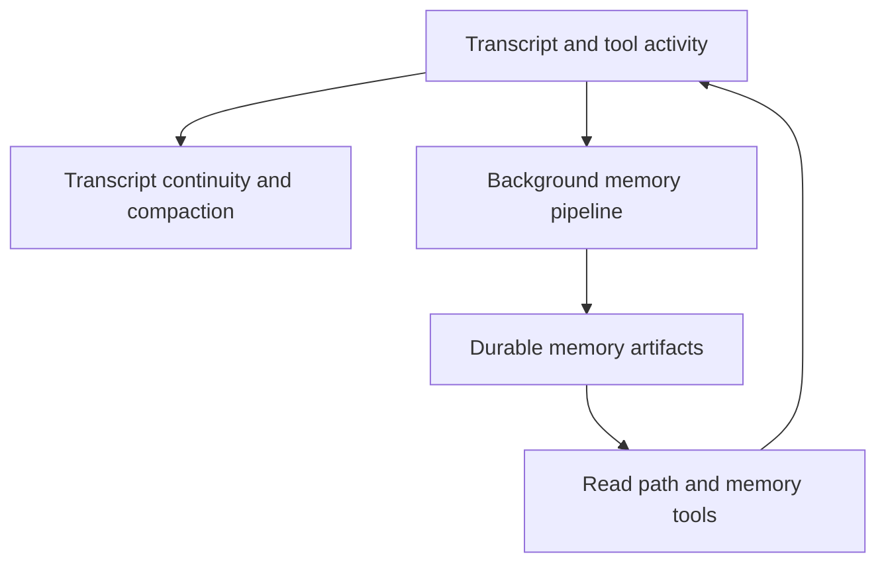

# Memory Systems

Tulkun uses multiple memory layers because a single generic “memory” feature is
not enough for serious agent work.

This page explains the roles, boundaries, and interactions of:

- per-primary-agent durable memory
- the memory read path
- transcript continuity
- the background memory pipeline

Every memory feature and tool is on by default. Each feature remains
individually configurable, so any single feature can be turned off through its
configuration flag without affecting the others.

## Why Tulkun Splits Memory Into Multiple Systems

Different memory problems require different tools.

For example:

- finding a relevant old fact is not the same as summarizing the current session
- deciding what to inject into the next turn is not the same as long-term consolidation
- keeping context continuity is not the same as writing durable notes

Tulkun therefore separates memory by job, not by storage location alone.

## The Main Memory Roles

## Durable Memory

Durable memory is the set of long-lived markdown artifacts written per primary
agent under that agent's memory root.

Memories for different primary agents are fully isolated: each primary agent
sees only its own memory root, and neither the read path nor the tools can
reach another agent's memories.

Durable memory is produced by the background pipeline and read back through the
read path and the namespaced memory tools.

## The Read Path

The read path decides what durable memory is surfaced to the model.

When memory is present, the read path injects a compact developer instruction
built from the primary agent's memory summary, so the model can recall prior
knowledge before continuing.

The read path does not replay raw transcript. It surfaces consolidated durable
memory.

## Memory Tools

The namespaced memory tools operate on the primary agent's memory root:

- `memories_list` lists entries under the memory root
- `memories_read` reads a memory file with line offsets and caps
- `memories_search` searches memory files by substring
- `memories_add_ad_hoc_note` writes a single new ad-hoc note

These tools are registered by default. They are scoped to the active primary
agent and reject paths that escape the memory root, hidden components, and
symlinks.

## Transcript Continuity

Transcript continuity is provided by the persisted transcript and
replacement-history compact checkpoints.

It does not create a separate continuity artifact.

### Why Transcript Continuity Exists

Long sessions accumulate too much model-active history to be replayed verbatim
forever.

Local summary compaction asks the current main model to preserve:

- the current state of the work
- unresolved problems
- key decisions
- corrections from the user
- the next useful continuation point

available in a compact form. OpenAI remote compaction instead stores the
provider's complete replacement history, including its opaque compaction item.

### What Triggers A Checkpoint

Automatic compaction runs at the model's token threshold before a turn and
between model samples. `/compact` triggers the identical checkpoint pipeline
manually. There is no background transcript-refresh job and no separate compact
agent.

### What Transcript Continuity Produces

The transcript continuity artifact is designed to preserve current continuity
rather than to become a permanent durable memory entry.

It is especially important because:

- future turns resume from the latest complete replacement history
- resumed sessions can recover current state faster

## The Background Memory Pipeline

The background pipeline turns completed turns into durable memory without
blocking the user-facing turn.

At a high level:

1. Stage 1 extracts raw memory from eligible completed turns and stores it in
   the state database.
2. Stage 2 consolidates stored stage1 outputs into durable markdown artifacts
   under the primary agent's memory root.

Stage1 outputs are pruned when they go unused, and generation can be excluded
for a session when external context may have entered its transcript.

## How The Memory Layers Work Together

The layers are most useful when understood as a pipeline rather than as a list.

- the background pipeline turns turns into durable memory
- the read path decides what durable memory is worth recalling into the current turn
- the memory tools let the model list, read, search, and note memory explicitly
- transcript continuity keeps current continuity compressed

That interaction is what lets Tulkun sustain longer sessions without depending
on raw transcript replay alone.

## Practical Reading Guidance

If you are configuring behavior:

- use `/config/agents-and-models` for the `memory` block

If you are reasoning about continuity:

- read [Context and Compaction](/guide/context-and-compaction) next

## Related

- [Context and Compaction](/guide/context-and-compaction)
- [Skills and Tools](/guide/skills-and-tools)
- [Subagents](/guide/subagents)
