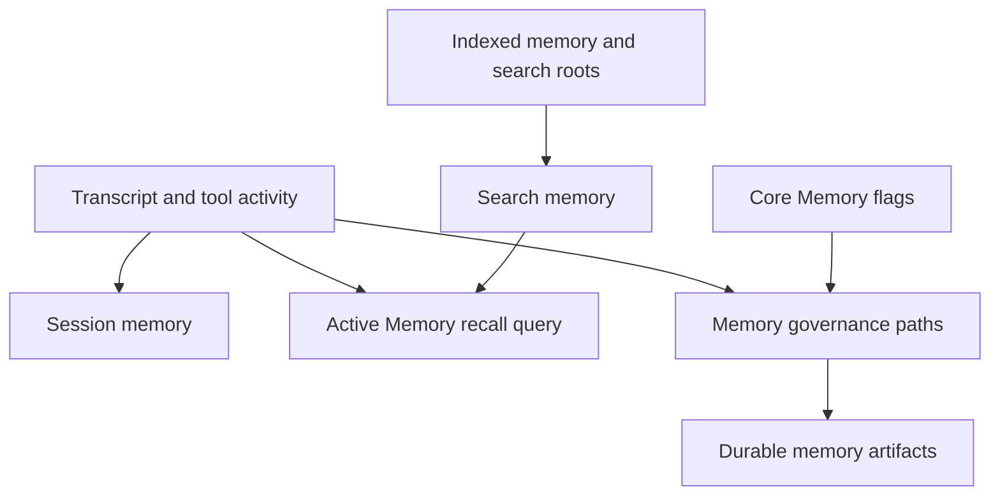

# Memory Systems

Tulkun uses multiple memory layers because a single generic “memory” feature is
not enough for serious agent work.

This page explains the roles, boundaries, and interactions of:

- retrieval-oriented search memory
- Active Memory
- session memory
- memory governance
- Core Memory and dreaming flags

## Why Tulkun Splits Memory Into Multiple Systems

Different memory problems require different tools.

For example:

- finding a relevant old fact is not the same as summarizing the current session
- deciding what to inject into the next turn is not the same as long-term consolidation
- keeping context continuity is not the same as exporting a search index

Tulkun therefore separates memory by job, not by storage location alone.

## The Main Memory Roles

## Search Memory

Search memory is Tulkun's retrieval-oriented memory layer.

Its job is to make previously written or indexed information discoverable again.

This matters when:

- workspace or memory data should be searched rather than replayed from transcript
- embedding-backed retrieval is available
- fallback retrieval modes are needed when vector infrastructure is absent

Search memory is usually configured through `agents.defaults.memory_search`.

Operationally, it can include:

- provider and model selection
- remote embedding or search services
- extra search roots
- hybrid ranking
- vector-store configuration

Search memory does not decide by itself what enters the current turn. It makes
candidate information discoverable.

## Active Memory

Active Memory is a turn-time recall mechanism.

Its job is to decide whether useful prior knowledge should be summarized and
brought into the current turn before the main response continues.

That makes it fundamentally different from plain retrieval.

### What Active Memory Actually Does

At a high level, Active Memory:

1. decides whether the current agent and chat type are allowed to use it
2. builds a recall query from the current turn and recent session material
3. runs a dedicated recall flow
4. returns a short summary for context injection
5. caches results briefly to avoid redundant repeated work

### Why Active Memory Is Separate From Session Memory

Session memory summarizes the state of the current conversation as an artifact.

Active Memory is a live recall step for the next turn.

That means:

- session memory is continuity-oriented
- Active Memory is prompt-injection-oriented

### Active Memory Defaults That Matter Operationally

The runtime has effective defaults for:

- allowed agents: `main`
- allowed chat types: `direct`
- query mode: `recent`
- prompt style: `balanced`
- timeout: `15000 ms`
- summary size cap: `220 chars`
- short-term user and assistant windows
- cache TTL: `15000 ms`

These defaults make Active Memory conservative by default.

### Query Modes

Active Memory supports multiple query modes because “recent context” can mean
different things in practice.

- `recent`: short recent-window recall
- `message`: more message-specific shaping
- `full`: broader transcript-conditioned recall

If no valid mode is configured, Tulkun falls back to `recent`.

### Prompt Styles

Prompt style controls how the recall prompt is phrased rather than whether
recall happens at all.

Supported styles include:

- `balanced`
- `strict`
- `contextual`
- `recall-heavy`
- `precision-heavy`
- `preference-only`

If the configured style is invalid or omitted, Tulkun infers a style from the
query mode.

## Session Memory

Session memory is Tulkun's structured summary of a live session.

It is stored as a dedicated artifact rather than being left implicit in the raw
transcript.

### Why Session Memory Exists

Long sessions accumulate too much detail to be replayed verbatim forever.

Session memory exists to keep:

- the current state of the work
- unresolved problems
- key decisions
- corrections from the user
- the next useful continuation point

available in a compact form.

### Session Memory Refresh Model

Tulkun refreshes session memory as a background post-turn task rather than as a
foreground blocking action.

This is important because:

- the assistant reply should not stall waiting for summarization
- session memory is maintenance work, not the primary user-visible result

### What Triggers A Refresh

Session memory refresh is tied to session growth rather than to a fixed timer.

Operationally, Tulkun considers factors such as:

- transcript growth
- token growth
- recent tool-call activity
- whether the recent assistant turn created a natural extraction point

This makes refresh behavior adaptive rather than purely periodic.

### What Session Memory Produces

The session memory artifact is designed to preserve current continuity rather
than to become a permanent knowledge base entry.

It is especially important because:

- compaction prefers it as a continuity seed
- future turns can use it instead of replaying large raw histories
- resumed sessions can recover current state faster

## Memory Governance

Memory governance is Tulkun's scheduled memory-maintenance layer.

This is configured under `agents.defaults.memory_govern`.

It is responsible for the policy side of memory maintenance, including options
such as:

- promotion cadence
- REM-style cadence
- reindex-after-write behavior
- dry-run promotion mode
- write debouncing

The governance layer matters because not all memory transitions should happen
inline during the user-facing turn.

## Core Memory And Dreaming

Tulkun exposes a `memory.core` block and a documented dreaming state.

The important product interpretation is:

- `memory.core` represents the documented Core Memory surface
- `dreaming` flags mirror consolidation-oriented state
- when dreaming frequency is unset, Tulkun reports it as `manual`

The dreaming flags are not a separate magical memory engine. They are part of
the documented memory-governance and consolidation story.

## How The Memory Layers Work Together

The layers are most useful when understood as a pipeline rather than as a list.

- search memory makes information discoverable
- Active Memory decides what is worth recalling into the current turn
- session memory keeps current continuity compressed
- governance paths maintain longer-lived structure around those artifacts

That interaction is what lets Tulkun sustain longer sessions without depending
on raw transcript replay alone.

## Practical Reading Guidance

If you are configuring behavior:

- use `/config/agents-and-models` for search memory and governance settings
- use `/config/memory-and-runtime-features` for Active Memory and Core Memory flags

If you are reasoning about continuity:

- read [Context and Compaction](/guide/context-and-compaction) next

## Related

- [Context and Compaction](/guide/context-and-compaction)
- [Skills and Tools](/guide/skills-and-tools)
- [Subagents and Workboards](/guide/subagents-and-workboards)
