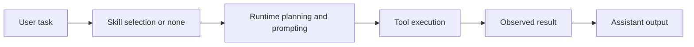

# Skills and Tools

Tulkun has both tools and skills because action execution and operating
knowledge are different system concerns.

This page explains:

- what tools are in Tulkun's architecture
- what skills are
- how they interact
- how related systems such as hooks, MCP servers, and skill-specific config fit in

## Tools: The Action Surface

Tools are the runtime capabilities Tulkun can call to do work.

Examples include:

- reading and editing files
- running shell commands
- querying version control state
- performing web access
- requesting user input
- using gateway- or host-backed capabilities

The key point is that tools change Tulkun from a text generator into an
operational agent.

## Why Tool Architecture Matters

In a serious coding agent, tools are not optional extras.

They determine:

- what the agent can actually inspect
- what it can actually change
- how observable its work is
- where safety decisions must be applied

That is why tools are attached to runtime policy, hooks, approvals, and
sandboxing rather than treated as simple helpers.

## Skills: Packaged Operating Knowledge

Skills are reusable instruction assets that improve how Tulkun approaches a
class of tasks.

A skill is not primarily “an action.” It is a packaged way of working.

This means a skill can provide:

- a task-specific process
- standards and constraints
- references or templates
- usage guidance
- supporting scripts or assets

## Why Skills And Tools Must Stay Separate

If the two concepts are flattened together, the system loses clarity.

Tulkun needs to answer two different questions:

1. what can the agent execute?
2. how should the agent approach this kind of task?

Tools answer the first question.
Skills answer the second.

## How A Skilled Tool-Using Turn Works



The skill changes how the task is framed.
The tools change what the task can accomplish.

## Skill Lifecycle

Tulkun treats skills as managed assets, not as random prompt fragments.

That makes several workflows possible:

- discovering installed skills
- enabling or disabling skills
- installing new skills
- creating or updating a skill

This matters because the value of a skill system is not only the instructions
inside one skill. It is also the ability to manage skills over time.

## Scope And Distribution

Tulkun's skill ecosystem is not limited to one global folder.

In practice, skills can exist in different roots and scopes, which allows:

- system-provided skills
- workspace-oriented skills
- user-managed shared skills

That separation is important because some skills are product-level capabilities,
while others are local workflow assets.

## Skill Root Priority

When Tulkun loads or resolves a skill by name, it searches the current skill
roots in priority order. A same-name skill in a higher-priority root shadows the
lower-priority copy.

The current Tulkun runtime skill roots are:

| Priority | Root |
| --- | --- |
| 1 | `<current-workspace>/.tulkun/skills` |
| 2 | `$TULKUN_HOME/workspace/skills` |
| 3 | `$TULKUN_HOME/skills` |
| 4 | `~/.agents/skills` |
| 5 | `$TULKUN_HOME/skills/.system` |

The project root is resolved from the current working directory. `$TULKUN_HOME`
is Tulkun's active home directory.

Skills are stored under a root as:

```text
<skill-root>/<skill-name>/SKILL.md
```

For example, these all define a skill named `github-issue-autofix` at different
priorities:

```text
<current-workspace>/.tulkun/skills/github-issue-autofix/SKILL.md
$TULKUN_HOME/workspace/skills/github-issue-autofix/SKILL.md
$TULKUN_HOME/skills/github-issue-autofix/SKILL.md
$TULKUN_HOME/skills/.system/github-issue-autofix/SKILL.md
```

If more than one root contains the same skill name, Tulkun uses the first match
in the priority table. That means:

- a project skill overrides workspace, home, cross-tool, and system skills
- a workspace skill overrides home, cross-tool, and system skills
- a home skill overrides cross-tool and system skills
- cross-tool skills override system skills
- `$TULKUN_HOME/skills/.system` is always the lowest-priority fallback

Built-in Tulkun skills are embedded in the Tulkun binary and installed into
`$TULKUN_HOME/skills/.system`. They are available by default, but they do not
override same-name project, workspace, or user-managed skills.

## Skill-Specific Configuration

Some skills expose their own config under the `skills:` section of
`tulkun.yaml`.

This is especially important for skills that need external resources, such as:

- database connections
- service credentials
- environment-specific policies

That configuration belongs to the skill extension surface, not to the core
runtime schema.

## MCP Servers And External Capability Surfaces

Tulkun can also expose external capability surfaces through MCP servers.

These are not the same thing as skills, but they are related in practice:

- a skill may recommend how to use an MCP capability
- the MCP server provides actual external tools or resources
- the runtime still decides how those capabilities are presented and governed

So the capability stack often looks like:

- skill for operating guidance
- MCP server for external surface
- tool runtime for execution

## Hooks As Tool-Adjacent Automation

Hooks are adjacent to the tool system because they can run:

- before a tool call
- after a successful tool call
- after a failed tool call
- on session lifecycle events

Hooks are not tools and not skills.

They are automation glue around runtime events.

That distinction matters:

- tools perform requested work
- hooks react to lifecycle events
- skills shape how work is approached

## Why This Separation Improves Reliability

This architecture avoids several failure modes:

- overloading prompts with too much embedded operational process
- turning every task into manual tool choreography
- making reusable workflows impossible to standardize
- hiding automation inside undocumented prompt conventions

Instead, Tulkun keeps the capability system explicit.

## Practical Mental Model

Use this model in daily work:

- if Tulkun needs to act, think tools
- if Tulkun needs a reusable way of approaching the task, think skills
- if Tulkun needs external capability surfaces, think MCP
- if Tulkun needs lifecycle automation, think hooks

That model keeps the product understandable even as the capability surface grows.

## Related

- [CLI Command Reference](/guide/cli-command-reference)
- [Subagents](/guide/subagents)
- [Safety Model](/guide/safety-model)
