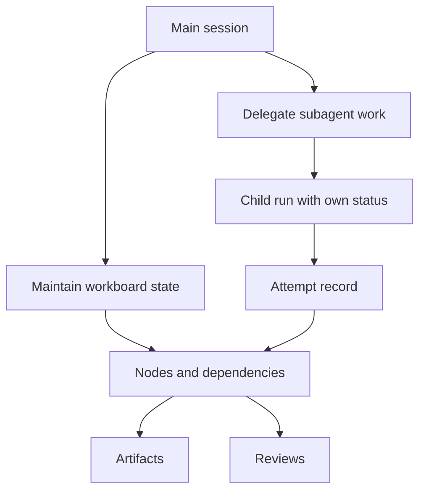

# Subagents and Workboards

Tulkun supports both delegated execution and structured task state.

These are related, but they are not the same system:

- subagents are for doing bounded child work
- workboards are for representing, tracking, and reviewing structured work

This page explains both in depth.

## Why Tulkun Needs Both

A serious agent runtime eventually runs into two different scaling problems.

The first problem is execution scale:

- one main agent should not do every side task inline

The second problem is coordination scale:

- not all work fits naturally into one transcript

Subagents solve the first problem.
Workboards solve the second.

## Subagents

Subagents are Tulkun's delegation primitive.

They let the main runtime hand off work that should be:

- isolated
- role-specific
- independently observable
- resumable or one-shot, depending on subtype

## Two Main Subagent Styles

Tulkun exposes more than one delegated execution style.

### Fresh Typed Subagents

Typed subagents are built around predefined role definitions such as:

- `general-purpose`
- `explore`
- `plan`
- `verification`

These types exist because delegated work often needs clear behavioral contracts.

For example:

- `explore` is read-only
- `plan` is planning-only
- `verification` tries to falsify the implementation rather than endorse it

### Forked Subagents

Forked subagents start from cache-safe parent context and continue as a child
execution branch.

This matters when:

- the child needs stronger continuity with parent prompt state
- the delegated work should preserve a traceable relation to the parent run

Forked child runs are explicitly marked as a forked runtime kind rather than
being treated as ordinary main-thread execution.

## Coordinator Mode

Tulkun also includes a coordinator mode for step-based task decomposition.

Coordinator mode turns a larger goal into a plan of bounded steps, then executes
those steps under structured orchestration.

At a high level, the flow is:

1. generate a JSON plan with steps, dependencies, and optional agent names
2. obtain approval if required
3. execute steps in dependency order
4. substitute completed outputs into downstream step prompts
5. record success and failure at the step level

This is different from casual delegation because the coordinator is explicitly
plan-shaped.

## Subagent Identity And History

Tulkun keeps subagent history as a first-class artifact.

Tracked fields include things such as:

- agent identity
- agent kind
- parent run
- child run
- session
- task text
- status
- output or error
- runtime kind
- one-shot vs continuable behavior

This makes subagent work inspectable rather than ephemeral.

## Subagent Lifecycle States

From a product perspective, the important lifecycle states are:

- running
- ok
- failed
- cancelled

That state is useful because delegated work is still operational work. It needs
to be resumed, audited, or reviewed, not just “generated.”

## Workboards

Workboards are Tulkun's structured task-tracking system.

They exist because many tasks need more durable structure than a transcript can
provide.

## Workboard Data Model

At a high level, a workboard contains:

- a board
- nodes
- edges
- attempts
- comments
- artifacts
- reviews

### Boards

A board represents the overall work container.

It includes:

- title
- description
- template
- status
- workspace path

### Nodes

Nodes represent units of work.

Tulkun supports multiple node kinds, including:

- initiative
- epic
- milestone
- sprint
- story
- task
- test task
- bug
- version
- review gate
- evidence bundle
- document subject
- finding
- decision
- handoff

This is one reason workboards are more than a kanban list. They can represent
different kinds of operational structure.

### Node Statuses

Nodes also carry execution state:

- `draft`
- `ready`
- `running`
- `blocked`
- `awaiting_review`
- `done`
- `failed`
- `cancelled`

These statuses are the main state machine for user-facing work progress.

### Edges

Edges define structural relationships between nodes, such as:

- parent/child
- depends on
- blocks
- derived from
- reviews
- evidences
- supersedes

This is how workboards represent dependency and review structure rather than
just flat task order.

### Attempts

Attempts record execution tries for a node.

They track:

- ordinal number
- runner kind
- lane
- claimed-by identity
- attempt status
- heartbeat
- output summary
- error

Attempt statuses include:

- queued
- claimed
- running
- succeeded
- failed
- cancelled
- expired

This is important because workboard execution is retry-aware.

### Artifacts And Reviews

Artifacts record evidence or deliverables attached to work.

Reviews record evaluation state:

- pending review
- approved
- rejected
- needs more work

This makes workboards suitable for review-heavy and audit-heavy workflows, not
just software task lists.

## Progress And Reaping

Two workboard behaviors matter operationally.

### Parent Progress Aggregation

Parent nodes can derive progress from active children.

In practice:

- done children contribute full progress
- cancelled children are excluded
- parent progress becomes the average of active child progress

This gives the board a meaningful roll-up model.

### Attempt Reaper

Workboards include a background reaper for stale or timed-out attempts.

The reaper can:

- expire attempts with stale heartbeat
- expire attempts that exceed node timeout
- move running nodes to blocked when their current attempt expires
- fail blocked nodes that exhausted max attempts

This matters because long-running structured work must handle abandonment and
timeout, not just success.

## Workboard Views

Workboards can be projected in more than one way.

Common projections include:

- tree view
- kanban view
- list view

This matters because dependency work and delivery work are often easier to read
in different shapes.

## How Subagents And Workboards Fit Together

Subagents and workboards are strongest when used together.

- a workboard node can represent a bounded work item
- an attempt can record one execution of that work
- a subagent can perform the execution
- artifacts and reviews can record the result

So the relationship is:

- subagents execute
- workboards organize
- attempts connect execution to structure

## Coordination Diagram

## Practical Interpretation

Use subagents when:

- a bounded task should run in a dedicated child context
- different behavioral contracts are needed for part of the work
- focused read-only exploration or verification is needed

Use workboards when:

- work spans multiple stages
- dependencies matter
- retries or attempts matter
- review and evidence matter
- the task structure should outlive one prompt window

## Related

- [Architecture](/guide/architecture)
- [Skills and Tools](/guide/skills-and-tools)
- [Safety Model](/guide/safety-model)
