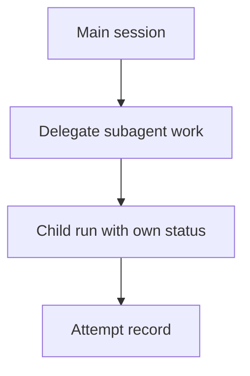

# Subagents

Tulkun supports delegated execution through subagents.

Subagents are for doing bounded child work: isolated, role-specific units of
execution that the main runtime can hand off and track.

This page explains them in depth.

## Why Tulkun Needs Subagents

A serious agent runtime eventually runs into an execution-scale problem:

- one main agent should not do every side task inline

Subagents solve that problem. They let larger work be split into delegated child
runs instead of crowding a single transcript.

## Subagents

Subagents are Tulkun's delegation primitive.

They let the main runtime hand off work that should be:

- isolated
- role-specific
- independently observable
- resumable or one-shot, depending on subtype

## Two Main Subagent Styles

Tulkun exposes more than one delegated execution style.

### Fresh Typed Subagents

Typed subagents are built around predefined role definitions such as:

- `general-purpose`
- `explore`
- `plan`
- `verification`

These types exist because delegated work often needs clear behavioral contracts.

For example:

- `explore` is read-only
- `plan` is planning-only
- `verification` tries to falsify the implementation rather than endorse it

### Forked Subagents

Forked subagents start from cache-safe parent context and continue as a child
execution branch.

This matters when:

- the child needs stronger continuity with parent prompt state
- the delegated work should preserve a traceable relation to the parent run

Forked child runs are explicitly marked as a forked runtime kind rather than
being treated as ordinary main-thread execution.

## Coordinator Mode

Tulkun also includes a coordinator mode for step-based task decomposition.

Coordinator mode turns a larger goal into a plan of bounded steps, then executes
those steps under structured orchestration.

At a high level, the flow is:

1. generate a JSON plan with steps, dependencies, and optional agent names
2. obtain approval if required
3. execute steps in dependency order
4. substitute completed outputs into downstream step prompts
5. record success and failure at the step level

This is different from casual delegation because the coordinator is explicitly
plan-shaped.

## Subagent Identity And History

Tulkun keeps subagent history as a first-class artifact.

Tracked fields include things such as:

- agent identity
- agent kind
- parent run
- child run
- session
- task text
- status
- output or error
- runtime kind
- one-shot vs continuable behavior

This makes subagent work inspectable rather than ephemeral.

## Subagent Lifecycle States

From a product perspective, the important lifecycle states are:

- running
- ok
- failed
- cancelled

That state is useful because delegated work is still operational work. It needs
to be resumed, audited, or reviewed, not just “generated.”

## Coordination Diagram

## Practical Interpretation

Use subagents when:

- a bounded task should run in a dedicated child context
- different behavioral contracts are needed for part of the work
- focused read-only exploration or verification is needed

## Related

- [Architecture](/guide/architecture)
- [Skills and Tools](/guide/skills-and-tools)
- [Safety Model](/guide/safety-model)
