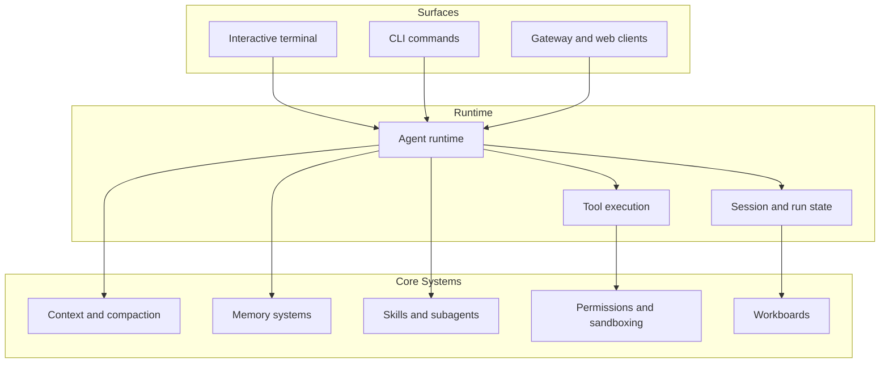

## What Tulkun Is

Tulkun is an open-source AI agent product for both development work and everyday
productivity work. It is a terminal-based AI coding agent for developers, and it
is also a gateway runtime for office, team, and automation workflows that need
APIs, web clients, channel integrations, memory, approvals, and operational
control.

That dual identity is the point. Tulkun is not trying to choose between a local
developer tool, an office assistant, and a service gateway. It gives those
surfaces access to the same core runtime concepts:

- an interactive terminal experience for development and power-user work
- a service surface for gateway, web-backed, and channel-backed use cases
- configurable agent, model, and memory behavior
- structured task coordination through workboards and subagents
- layered safety controls around permissions and execution

## Why Tulkun Is Different

Most AI coding agents start from one local interface. Most gateway products
start from message routing or API orchestration. Tulkun is designed as a unified
agent runtime across both product categories, while also leaving room for
ordinary office users who need an agent to help with recurring, document-heavy,
or communication-heavy work.

Compared with a typical terminal coding agent, Tulkun is not limited to one
interactive shell session. The gateway exposes the same runtime through
service-backed sessions, WebSocket chat, REST APIs, run events, file APIs,
permissions APIs, skills management, workboards, and channel delivery.

Compared with a typical gateway, Tulkun is not just a pass-through bot router.
Inbound channel messages enter an agent runtime with session state, tool
execution, context assembly, memory refresh, guardrails, permissions, and
post-turn lifecycle hooks.

Compared with a typical office assistant, Tulkun is not only a chat UI. It has
durable sessions, memory systems, files, channels, scheduled work, task
coordination, approvals, and run observability.

This is the product bet: a leading open-source agent should be powerful in the
terminal, useful as infrastructure, approachable for everyday productivity, and
honest about the runtime systems that make long-running work safe and
inspectable.

## Product Advantages

### One Runtime Across Local And Service Surfaces

Tulkun's interactive terminal, management CLI, gateway APIs, web clients, and
channel integrations are not separate products. They share sessions, runs,
tools, permissions, memory, and slash-style interaction models across
development and office workflows.

### Channel Integrations Are Runtime Integrations

The gateway channel registry includes concrete adapters for bot-token,
webhook-bridge, outbound-bridge, and policy-driven chat platforms. Channel
messages can create or continue agent work instead of stopping at message
delivery.

### State Is A First-Class Product Object

Tulkun tracks sessions and runs instead of treating every request as an isolated
prompt. That state is visible through chat history, run events, subagent
history, context diagnostics, tool audit records, cost summaries, workboards,
and task attempts.

### Memory Is Split Into Real Mechanisms

Tulkun separates retrieval memory, Active Memory, session memory, daily memory,
context compaction, and post-turn maintenance. This makes memory easier to
inspect, tune, and reason about than a single vague "agent memory" feature,
whether the memory is about a codebase, a project, a document workflow, or a
team process.

### Delegation Has Execution Surfaces

Subagents, fanout, coordinator mode, child run tracking, and workboards give
Tulkun a way to handle larger tasks without burying the plan inside one chat
transcript. That applies to implementation work, research, document processing,
operations, review, and other multi-step office tasks.

### Controls Stay Close To Execution

Permissions, approval memory, sandbox behavior, path restrictions, and
guardrails are connected to actual tool and gateway flows. The goal is not only
to block unsafe actions, but to make powerful agent work understandable while it
happens.

## Who This Documentation Is For

This site is written for five kinds of readers.

### New Users

You want to install Tulkun, start a session, understand what the main commands
do, and get useful work done without guessing how the system is shaped.

### Developers

You want a terminal-first coding agent that can understand a trusted workspace,
use tools, manage context, preserve memory, coordinate subagents, and keep
execution under explicit control.

### Productivity Users

You want an agent gateway for daily work outside the IDE: document workflows,
knowledge recall, recurring tasks, approvals, team messages, and automation
through channels such as Slack, email, WeCom, Weixin, Feishu, DingTalk, QQ, or
webhooks.

### Operators And Power Users

You want to configure runtime behavior, manage models, understand permission and
sandbox settings, and know which surface to use for which task.

### Advanced Users And Contributors

You want a strong mental model for how Tulkun handles context, memory, tool
execution, long-running work, and agent coordination.

## Reading Paths

### Start Here

1. [Getting Started](/guide/getting-started)
2. [CLI and Surfaces](/guide/cli-and-surfaces)
3. [Architecture](/guide/architecture)
4. [Memory Systems](/guide/memory-systems)

This path answers:

- How do I start Tulkun?
- What should I expect on first run?
- Which surface should I use?
- Which core feature area should I read next?

### Configure Tulkun

1. [Configuration Reference](/config/overview)
2. [Runtime, Gateway, And Channels](/config/runtime-gateway-and-channels)
3. [Agents and Models](/config/agents-and-models)
4. [Sandbox and Permissions](/config/sandbox-and-permissions)
5. [Memory, Compaction, And Runtime Features](/config/memory-and-runtime-features)

This path answers:

- Where do the main runtime settings live?
- How do I configure the main agent and its model providers?
- How are safety decisions made and enforced?

### Understand The System

1. [Architecture](/guide/architecture)
2. [Context and Compaction](/guide/context-and-compaction)
3. [Memory Systems](/guide/memory-systems)
4. [Skills and Tools](/guide/skills-and-tools)
5. [Subagents and Workboards](/guide/subagents-and-workboards)
6. [Safety Model](/guide/safety-model)

This path answers:

- How does Tulkun assemble context?
- What kinds of memory does it maintain?
- How do tools, skills, subagents, and workboards fit together?
- What prevents unsafe execution?

## Product Areas At A Glance

### Interactive Work

Tulkun is terminal-first for developers and power users. A large part of the
day-to-day experience is centered on interactive sessions, slash commands,
approvals, session switching, and visible run progress.

### Service And Integration

Tulkun also runs as a service-oriented gateway, which matters for web clients,
API-backed sessions, channel integrations, shared access patterns, automation,
and operational APIs.

### Knowledge And Coordination

Tulkun's memory stack, skill system, subagent model, and workboards exist to
support longer-running, more structured work instead of isolated chat answers:
coding tasks, document-heavy office workflows, recurring operations, and team
coordination.

### Safety And Control

Tulkun separates policy, approval, and execution boundaries. Permissions,
sandboxing, path protection, and guardrails are part of the product story, not
an afterthought.

## System Overview

## Continue Reading

- [Getting Started](/guide/getting-started)
- [CLI Command Reference](/guide/cli-command-reference)
- [Architecture](/guide/architecture)
