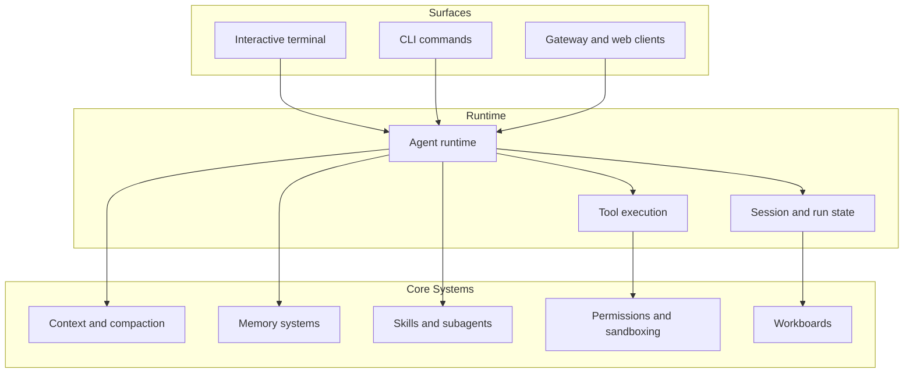

## What Tulkun Is

Tulkun is a local AI coding agent designed for hands-on technical work. It is
not just a chat window and not just a CLI wrapper. In practice, Tulkun combines:

- an interactive terminal experience for day-to-day work
- a service surface for gateway and web-backed use cases
- configurable agent, model, and memory behavior
- structured task coordination through workboards and subagents
- layered safety controls around permissions and execution

## Who This Documentation Is For

This site is written for three kinds of readers.

### New Users

You want to install Tulkun, start a session, understand what the main commands
do, and get useful work done without guessing how the system is shaped.

### Operators And Power Users

You want to configure runtime behavior, manage models, understand permission and
sandbox settings, and know which surface to use for which task.

### Advanced Users And Contributors

You want a strong mental model for how Tulkun handles context, memory, tool
execution, long-running work, and agent coordination.

## Reading Paths

### Start Here

1. [Getting Started](/guide/getting-started)
2. [CLI and Surfaces](/guide/cli-and-surfaces)
3. [Architecture](/guide/architecture)
4. [Memory Systems](/guide/memory-systems)

This path answers:

- How do I start Tulkun?
- What should I expect on first run?
- Which surface should I use?
- Which core feature area should I read next?

### Configure Tulkun

1. [Configuration Reference](/config/overview)
2. [Runtime, Gateway, And Channels](/config/runtime-gateway-and-channels)
3. [Agents and Models](/config/agents-and-models)
4. [Sandbox and Permissions](/config/sandbox-and-permissions)
5. [Memory, Compaction, And Runtime Features](/config/memory-and-runtime-features)

This path answers:

- Where do the main runtime settings live?
- How do I configure the main agent and its model providers?
- How are safety decisions made and enforced?

### Understand The System

1. [Architecture](/guide/architecture)
2. [Context and Compaction](/guide/context-and-compaction)
3. [Memory Systems](/guide/memory-systems)
4. [Skills and Tools](/guide/skills-and-tools)
5. [Subagents and Workboards](/guide/subagents-and-workboards)
6. [Safety Model](/guide/safety-model)

This path answers:

- How does Tulkun assemble context?
- What kinds of memory does it maintain?
- How do tools, skills, subagents, and workboards fit together?
- What prevents unsafe execution?

## Product Areas At A Glance

### Interactive Work

Tulkun is terminal-first. A large part of the day-to-day experience is centered
on interactive sessions, slash commands, approvals, session switching, and
visible run progress.

### Service And Integration

Tulkun also runs as a service-oriented system, which matters for gateway-driven
workflows, shared clients, automation, and operational APIs.

### Knowledge And Coordination

Tulkun's memory stack, skill system, subagent model, and workboards exist to
support longer-running, more structured technical work instead of isolated chat
answers.

### Safety And Control

Tulkun separates policy, approval, and execution boundaries. Permissions,
sandboxing, path protection, and guardrails are part of the product story, not
an afterthought.

## System Overview

## Continue Reading

- [Getting Started](/guide/getting-started)
- [CLI Command Reference](/guide/cli-command-reference)
- [Architecture](/guide/architecture)
