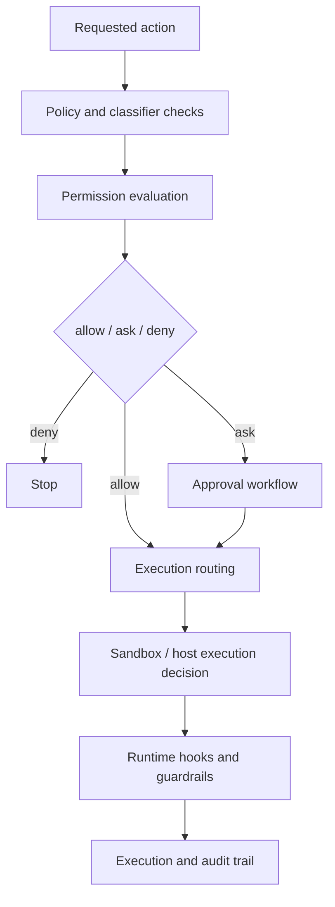

# Safety Model

Tulkun's safety model is layered because no single control is enough for an
agent that can inspect files, edit code, run commands, use external services,
and coordinate delegated work.

This page explains the layers and how they interact.

## The Safety Question Tulkun Has To Answer

For every meaningful action, Tulkun must answer at least three questions:

1. should this action happen at all?
2. if it happens, under what policy and approval state?
3. if it runs, how isolated should execution be?

That is why Tulkun separates permissions, approvals, sandboxing, and guardrails
instead of calling everything “security mode.”

## The Main Safety Layers

## Layer 1: Policy And Classification

Before execution, Tulkun can apply policy-style controls that help classify the
action.

Examples include:

- tool classification
- prompt-side rules
- hook-driven pre-tool decisions

These do not by themselves execute or deny a command, but they shape the
decision boundary.

## Layer 2: Permission Evaluation

Permission evaluation is the “should this happen?” layer.

Tulkun can decide that an action should be:

- allowed
- denied
- routed through explicit approval

This layer matters because not all tools are equally risky.

For example:

- reading a file is not the same risk as editing it
- editing a file is not the same risk as running a networked shell command

## Permission Memory And Destinations

Tulkun can persist permission intent at different destinations.

The main destinations are:

- session
- local settings
- project settings
- user settings
- CLI argument scope

This matters because the same approval does not always belong at the same scope.

For example:

- a one-off session approval should usually stay session-scoped
- a stable project rule may belong in project settings

## Permission Modes

Tulkun also supports different permission modes, including:

- `default`
- `acceptEdits`
- `bypassPermissions`
- `dontAsk`
- `plan`

These modes alter how aggressively Tulkun asks for approval and how it interprets
tool-risk posture in the current session.

## Layer 3: Sandboxed Vs Unsandboxed Execution

Once an action is allowed, Tulkun still must decide how it runs.

This is the sandbox layer.

It governs things such as:

- whether sandbox execution is active
- whether the platform supports sandboxing
- whether a given command bypasses sandboxing
- whether dangerous unsandboxed fallback is allowed

This distinction is crucial:

- permission approval is not the same thing as host-level freedom

## Filesystem And Network Isolation

Within sandbox execution, Tulkun can restrict:

- readable paths
- writable paths
- allowed domains
- denied domains
- local binding
- Unix socket access

These are not merely preferences. They are part of the execution contract.

## Path Protection

Tulkun also protects certain sensitive paths and secret-like surfaces through
policy and deny logic.

This matters because many high-risk failures in coding agents are not malicious
by design. They are accidental:

- reading secrets
- modifying host-critical paths
- exposing credentials

Path protection reduces the blast radius of those mistakes.

## Hooks As Safety Extensions

Hooks can participate in safety, especially `PreToolUse`.

This matters because a hook can:

- inspect the requested tool input
- return an allow, ask, or deny style decision
- rewrite or constrain the effective input

That makes hooks part of Tulkun's extended safety fabric, not just automation
glue.

## Guardrails

Guardrails are a complementary layer around prompt, input, output, and
retrieval behavior.

They are not identical to permissions or sandboxing.

Their role is to reduce unsafe or low-quality behavior around the action, not
only to decide whether the action is authorized.

Examples include:

- prompt delimiters
- sandwich reminders
- input rules
- input substring blocking
- retrieval baseline checks
- heuristic output checks
- moderation sidecars

## Why Tulkun Keeps These Layers Separate

The separation improves both safety and usability.

If all controls were collapsed into one binary gate, Tulkun would lose important
degrees of control:

- an action could be approved but still sandboxed
- a prompt could pass approval but still trigger guardrails
- a hook could request approval without denying the action forever
- a project could allow one class of edit without allowing unrestricted shell access

That is the difference between a usable runtime policy system and a blunt block
list.

## Auditability

A useful safety model must also be observable.

Tulkun's run and approval surfaces make it possible to track:

- what was requested
- what required approval
- which destination stored the decision
- which tool ran
- whether a subagent or child run was involved

This matters because safety is not only about prevention. It is also about
explanation and review.

## Practical User Model

The most useful way to think about Tulkun safety is:

- permissions decide whether an action is acceptable
- approvals decide who must confirm it and how long that decision lasts
- sandboxing decides how isolated execution should be
- guardrails reduce unsafe prompt and output behavior around the action

That layered interpretation matches how the product is actually structured.

## Related

- [Sandbox And Permissions](/config/sandbox-and-permissions)
- [Skills and Tools](/mechanics/skills-and-tools)
- [Architecture](/mechanics/architecture)
