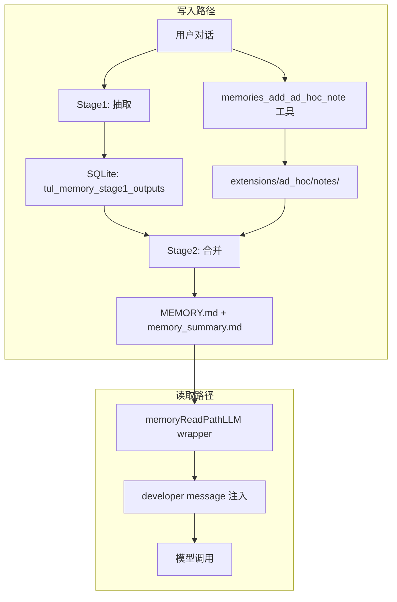

# Memory 原理与机制

本文基于 tulkun 源码分析，系统阐述 tulkun memory 的隔离维度、写入机制、读取注入机制、LLM Provider 兼容性，以及一个完整的场景示例。适合需要深入理解 memory 内部行为的开发者阅读。

如果你只需要产品层面的概览，请先阅读 [Memory Systems](/guide/memory-systems)。

::: tip 双语版本
[English version](/guide/memory-internals)
:::

## 架构总览



tulkun memory 由以下核心组件构成：

| 组件 | 所在包 | 职责 |
|------|--------|------|
| `Store` | `internal/memories` | 绑定单个 primary agent，所有读写以 `agent_id` 过滤 |
| `Pipeline` | `internal/memories` | 后台异步执行 Stage1 抽取 + Stage2 合并 |
| `memoryReadPathLLM` | `internal/agentrun` | LLM wrapper，每次模型调用时注入 memory_summary |
| dedicated memory tools | `internal/codetools` | `memories_list` / `memories_read` / `memories_search` / `memories_add_ad_hoc_note` |
| `localbackend.Backend` | `internal/memories/localbackend` | memory 文件系统的读写后端 |

## 隔离维度：Tenant，不是 Project

### 核心结论

tulkun memory 的唯一隔离边界是 **Tenant（primary agent / agentID）**，**不存在 project 维度的 memory 机制**。

### 证据

`Store` 绑定到单个 `agentID`，所有 SQL 查询都以 `agent_id=?` 作为过滤条件：

- **抽取** — `ClaimStage1JobsForStartup`（`jobs.go:102`）:
  ```sql
  WHERE agent_id=? AND memory_mode=? AND id<>? AND memory_source IN (?,?) AND updated_at>=? AND updated_at<=?
  ```
- **合并选择** — `SelectStage1ForPhase2`（`store.go:235`）:
  ```sql
  WHERE o.agent_id=? AND s.agent_id=? AND s.memory_mode=?
  ```
- **写入/删除/用量更新** — `UpsertStage1Output`、`DeleteThreadMemory`、`UpdateUsage` 全部 `agent_id=?`

合并 job 的 key 也是 tenant 本身：`consolidateJobKey(agentID) = agentID`（`jobs.go:43`）。

### memory 文件根 = per-tenant workspace root

```
ResolveRootForAgent(workspaceRoot) → <workspaceRoot>/memories/   (root.go:28)
```

- `workspaceRoot()`（`runner.go:1424`）= `r.WorkspaceRoot` 或 `~/.tulkun/workspace`，是 per-agent 的
- `MEMORY.md` / `memory_summary.md` 存在 per-tenant 目录下，**路径中没有 project key**

### `memories/project.go` 的函数服务其他子系统

`project.go` 定义了 `ProjectKey()` / `ProjectRoot()` / `GitBranch()`，但它们**不用于 memory store 的隔离/过滤**：

| 函数 | 真实用途 | 调用方 |
|------|---------|--------|
| `ProjectKey()` | plan 文件目录 `planstore.PlanDirForProject`、subagent 继承 | `clifacade/chat_session.go`、`workerhost/open.go` |
| `ProjectRoot()` | 文件工具默认路径、权限 | `clifacade/chat_session.go` |
| `GitBranch()` | 写入 `tul_sessions.git_branch` 列（会话元数据） | `clifacade`、`workerhost` |

`Store` 内部从不调用这些函数。

### Cwd / GitBranch 只是描述性元数据

`Stage1Output` 和 `SessionCandidate` 结构体中有 `Cwd`、`GitBranch` 字段，但它们：

1. 只被 SELECT 出来作为元数据
2. 写入 rollout summary 文件头部（`storage.go:78-84`）和 evidence JSONL（`evidence.go:30-34`）
3. **从未出现在任何 WHERE 子句中** — 不用于抽取/合并/读取的过滤

### 隔离测试验证

`tenant_isolation_test.go` 明确验证：两个 agent 共享同一个 SQLite DB，完全靠 `agent_id` 过滤实现隔离，project 不参与。

## 写入机制

memory 的写入有两条路径，最终汇合到同一份 `MEMORY.md`。

### 路径一：ad-hoc note（即时写入）

当用户明确要求"记住..."时，agent 调用 `memories_add_ad_hoc_note` 工具：

```
memories_add_ad_hoc_note
  → backend.AddAdHocNote(filename, note)                    (memory_tools.go:61)
  → 写入 <workspaceRoot>/memories/extensions/ad_hoc/notes/<timestamp>-<slug>.md
```

- 默认 `DedicatedTools=true`（`config.go:368`），工具默认注册
- 工具描述："Create one append-only ad-hoc memory note after the user explicitly asks Tulkun to remember, forget, or update something."
- 写入是**即时的**，但 note 只在 extensions 目录，**不在 `MEMORY.md` 中**
- `read_path.md` 模板列出的可查文件不包含 `extensions/ad_hoc/notes/`，所以 ad-hoc note **不会立即被主 agent 在 read path 看到**

### 路径二：自动抽取 + 合并（异步 pipeline）

#### 触发时机

每次根交互回合结束后，`maybeLaunchMemoryStartup`（`supervisorrun/run.go:186`）触发 `Pipeline.Run`：

```go
func maybeLaunchMemoryStartup(o Options, sessionID string) {
    if o.Runner == nil { return }
    if strings.TrimSpace(o.ParentRunID) != "" { return }   // 子 agent 不触发
    if !isRootInteractiveSource(querySourceForRun(o)) { return }
    o.Runner.LaunchMemoryStartup(sessionID)
}
```

#### Stage1：抽取

`ClaimStage1JobsForStartup` 从 `tul_sessions` 表中选择符合条件的会话：

- `agent_id=?` — 当前 tenant
- `memory_mode=enabled` — 会话开启了 memory
- `memory_source IN ('streamterm','webchat')` — 来自交互界面
- `updated_at >= now - MaxRolloutAgeDays` （默认 10 天）
- `updated_at <= now - MinRolloutIdleHours` （默认 **6 小时**空闲）

::: warning 6 小时空闲门槛
当前会话不到 6 小时空闲不会被抽取。这意味着用户刚说完"记住..."，这段对话不会被立即抽取为 raw memory，需要等会话空闲 6 小时后才会进入 Stage1。
:::

Stage1 用 ExtractLLM 从对话 transcript 中提取结构化 JSON（`raw_memory` / `rollout_summary` / `rollout_slug`），脱敏后写入 `tul_memory_stage1_outputs` 表。

#### Stage2：合并

`runStage2`（`pipeline.go:292`）**无论 Stage1 有无产出都会运行**：

1. `TryClaimGlobalPhase2` 抢合并锁（有 6 小时 cooldown）
2. `SelectStage1ForPhase2` 选出当前 tenant 的所有 stage1 输出
3. `syncPhase2WorkspaceInputs` 将输出同步到 memories 目录（`raw_memories.md` + `rollout_summaries/`）
4. `memoryWorkspaceDiff` 计算 memories 目录的 git diff
5. 若 `changed=true` → 合并 LLM 运行，读 workspace diff + ad-hoc notes，合并进 `MEMORY.md` + `memory_summary.md`
6. `validateConsolidationArtifacts` 验证产物（`MEMORY.md` 存在、`memory_summary.md` 首行为 `v1`）

::: tip ad-hoc note 的合并
ad-hoc note 作为新增文件出现在 git diff 中。合并 LLM 按 `ad_hoc_instructions.md` 的指示将 note 内容合并进 `MEMORY.md` 和 `memory_summary.md`。ad_hoc_instructions.md 声明："Every note must be consolidated in the memory structure."
:::

## 读取与注入机制

### 核心结论：MEMORY.md 从不直接注入

被自动注入的是 `memory_summary.md`（独立的索引/摘要文件），不是 `MEMORY.md`。`MEMORY.md` 只在注入的模板文本中被**提及**，agent 需要主动检索。

### 注入链路

**安装时机** — `loadLocked()`（`runner.go:729`）构建 LLM client chain：

```go
llmClient = wrapMemoryReadPathLLM(llmClient, r.workspaceRoot(), r.AppCfg)
```

触发场景：runner 初始化、config hot-reload、`/model` 切换。

**执行时机** — 每次 LLM `Execute` 调用（即每个 turn 的每次模型调用）：

```go
func (w *memoryReadPathLLM) Execute(ctx, messages, tools) {
    root, _ := memories.ResolveRootForAgent(w.workspaceRoot)
    instruction, _ := memories.RenderReadPathInstruction(root)  // 从磁盘实时读
    if instruction != "" {
        messages = memories.InjectDeveloperInstruction(messages, instruction)
    }
    return w.inner.Execute(ctx, messages, tools)
}
```

**无缓存** — 每次都从磁盘重新读 `memory_summary.md`。如果合并 pipeline 在两个 turn 之间更新了文件，下一次 LLM 调用立即看到新内容。

### 注入内容生成

```
<workspaceRoot>/memories/memory_summary.md
  → os.ReadFile                                        (read_path.go:19)
  → TrimSpace，空则跳过                                 (read_path.go:26-28)
  → truncateTextToTokenBudget(content, 2500)           (read_path.go:30)  ← 截断到 2500 token
  → renderTemplate(readPathInstruction, {              (read_path.go:31-34)
        base_path:      root.MemoryRoot,
        memory_summary: content,
    })
  → InjectDeveloperInstruction                         (read_path.go:37-49)
```

`renderTemplate` 是简单的 `strings.ReplaceAll`：把 `read_path.md` 模板全文中的 `{{ base_path }}` 和 `{{ memory_summary }}` 替换为实际值，**模板其余所有文本原样保留**。

最终注入的消息结构：

```
[System message]
[Developer message: read_path.md 模板全文 + memory_summary.md 截断内容]   ← 这里
[User/Assistant 消息...]
```

### read_path.md 模板内容

模板全文都会注入，包含：

| 模板部分 | 说明 |
|---------|------|
| 决策边界 | "Skip memory ONLY when..." 何时使用 memory |
| Memory layout | 列出 memory_summary.md / MEMORY.md / skills/ / rollout_summaries/ 的结构 |
| Quick memory pass | 5 步检索流程指导 |
| Citation 要求 | `<oai-mem-citation>` 格式规范 |
| Updating memories | "only when explicitly asked..." 写入指引 |
| `{{ memory_summary }}` | 替换为 memory_summary.md 截断到 2500 token 的全文 |
| `{{ base_path }}` | 替换为实际路径，如 `~/.tulkun/workspace/memories` |

### MEMORY.md 的三种可达路径

| 方式 | 机制 | 自动？ |
|------|------|--------|
| `memory_summary.md` 注入 | developer message，每次 LLM 调用 | ✅ 自动 |
| read_path 模板引导搜索 | 模板文本引导 agent "去搜 MEMORY.md" | ❌ 依赖 LLM 主动执行 |
| dedicated tools | `memories_search` / `memories_read` / `memories_list` | ❌ 依赖 LLM 主动调用 |

### 注入前置条件

1. `ReadPathEnabled(cfg)` = true（构造时检查）
   - 即 `features.memories=true` **且** `memories.use_memories=true`（默认都为 true）
2. `memory_summary.md` 文件存在且非空（运行时检查）
3. 每次 Execute 都重新检查

## LLM Provider 兼容性

注入的 developer message 的 role 是 **`developer`**（`llm.RoleDeveloper = "developer"`，`llm.go:260`）。

源码注释规定：不支持 developer role 的 provider 必须映射到最接近的指令 role。

| Provider | 发给 API 的 role | 源码位置 |
|----------|-----------------|----------|
| OpenAI Responses API | `developer`（原生支持） | `openai_responses_llm.go:649-654` |
| OpenAI-compatible（DeepSeek 等） | **降级为 `system`** | `openai_compat_llm.go:1075-1081` |
| Anthropic | **合并进 system parts** | `anthropic_agent_llm.go:194` |

不支持 `developer` role 的 provider 全部降级为 `system` role 发送，内容不会丢失。

## 场景示例：Project A 的"不要生成单元测试"记忆

### 场景描述

用户在 Java 项目 Project A 的根路径下启动 tulkun TUI，要求 primary agent 记住"Project A 不要生成单元测试代码"。

### 记到哪里？

记忆存储在 **agent（tenant）级别的 workspace 目录**，不是 project 级别：

```
<workspaceRoot>/memories/
```

其中 `<workspaceRoot>` = `rt.StateRoot()` = agent 的 workspace root（通常 `~/.tulkun/workspace`），**与用户启动 TUI 时的 Project A 路径无关**。

### 写入时序

```
1. 用户："记住 Project A 不要生成单元测试"
   → agent 调用 memories_add_ad_hoc_note
   → note 即时写入 <workspaceRoot>/memories/extensions/ad_hoc/notes/<timestamp>-<slug>.md
   （此时 note 不在 MEMORY.md 中，主 agent 在 read path 看不到）

2. 当前回合结束 → maybeLaunchMemoryStartup → Pipeline.Run
   → Stage1: MinRolloutIdleHours=6，当前会话不够空闲，不会被抽取
   → Stage2: runStage2 运行（若 6h cooldown 已过）
     → memoryWorkspaceDiff 检测到 ad-hoc note 为新增文件
     → 合并 LLM 运行，将 note 合并进 MEMORY.md + memory_summary.md

3. 之后的回合
   → memoryReadPathLLM.Execute 从磁盘读 memory_summary.md
   → 注入为 developer message
   → agent 看到记忆，在开发时遵循
```

### 是否能真实生效？

**能生效**，但有延迟和限制：

| 限制 | 原因 | 源码 |
|------|------|------|
| ad-hoc note 不会立即出现在 memory_summary.md | read_path.md 模板列出的可查文件不包含 `extensions/ad_hoc/notes/`，必须等合并进 MEMORY.md | `read_path.md:19-33` |
| 合并有 6 小时 cooldown | `phase2CooldownSeconds = 6*60*60` | `jobs.go:29` |
| 合并是异步后台运行 | `LaunchAsync` 起 goroutine，可能失败 | `pipeline.go:39-52` |

### 开发 Project A 时能否正常召回？

**合并完成后能召回**：

- `memory_summary.md` 每回合自动注入系统提示（截断到 2500 token）
- read_path.md 模板引导 agent 搜索 `MEMORY.md` 中的关键词
- agent 可用 `memories_search` / `memories_read` 主动检索

### 跨项目泄露问题

::: warning 不是 project 维度隔离
记忆存储在 agent（tenant）级 `<workspaceRoot>/memories/`，同一 agent 开发 Project B 时**也会看到**"Project A 不要生成单元测试"这条记忆。系统层面不做任何 project 过滤，是否只对 Project A 生效完全依赖 LLM 从记忆文本中的"Project A"自行推断。
:::

## 配置参数

所有 memory 配置项默认开启，可通过 YAML 配置调整：

```yaml
features:
  memories: true              # memory 总开关

memories:
  use_memories: true          # 读取路径开关
  generate_memories: true     # 生成（抽取）开关
  dedicated_tools: true       # dedicated memory tools 开关
  max_unused_days: 30         # stage1 输出最大未使用天数（超期清理）
  max_rollout_age_days: 10    # 抽取的最大会话年龄（天）
  max_rollouts_per_startup: 2 # 每次启动最多抽取的会话数
  min_rollout_idle_hours: 6   # 会话空闲多少小时后才抽取
  min_rate_limit_remaining_percent: 25  # 速率限制最低剩余百分比
```

源码位置：`internal/config/config.go:331-374`

## memory 产物文件结构

```
<workspaceRoot>/memories/
├── memory_summary.md          # 自动注入的摘要索引，首行必须为 v1
├── MEMORY.md                  # 记忆手册，agent 主动检索的主文件
├── raw_memories.md            # Stage1 合并的原始记忆（临时文件，Phase2 输入）
├── rollout_summaries/         # 每个会话的摘要回顾
│   └── <timestamp>-<hash>-<slug>.md
├── skills/                    # 可复用技能
│   └── <skill-name>/
│       └── SKILL.md
├── extensions/
│   └── ad_hoc/
│       ├── instructions.md    # ad-hoc note 合并指引
│       └── notes/             # 用户要求记住的内容（待合并）
│           └── <timestamp>-<slug>.md
└── phase2_workspace_diff.md   # Phase2 用的 git diff（临时，非持久产物）
```

## 局限性与注意事项

1. **无 project 维度隔离** — memory 按 tenant 隔离，同一 agent 的所有项目记忆混在同一份 `MEMORY.md` 中。跨项目约束可能互相干扰。

2. **合并延迟** — ad-hoc note 写入后不会立即生效，需等合并周期。最坏情况下需等待 6 小时 cooldown 过后才能合并。

3. **依赖 LLM 判断** — memory 的抽取、合并、检索都依赖 LLM 的判断能力。低能力模型可能抽取不到高信号记忆，或在检索时遗漏相关内容。

4. **memory_summary.md 截断** — 注入时截断到 2500 token。如果摘要过长，中间部分会被截断（`MiddleTokens` 策略），可能丢失关键内容。

5. **MEMORY.md 不自动注入** — 只有 `memory_summary.md` 自动注入。`MEMORY.md` 的内容需要 agent 主动通过工具或文件搜索读取。

## 相关文档

- [Memory Systems](/guide/memory-systems) — 产品层面的 memory 概览
- [Context and Compaction](/guide/context-and-compaction) — 会话连续性与压缩机制
- [Memory, Compaction, And Runtime Features](/config/memory-and-runtime-features) — 配置参考
- [Architecture](/guide/architecture) — 整体架构
